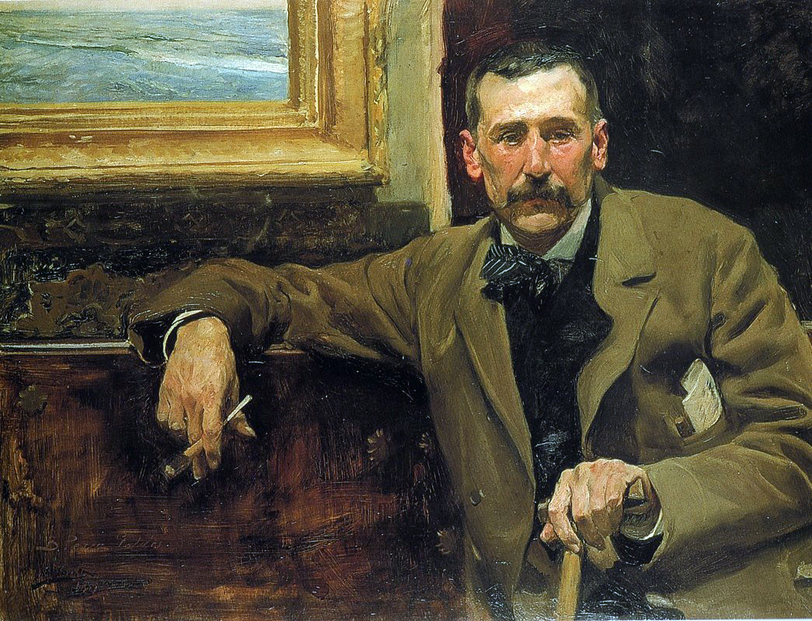
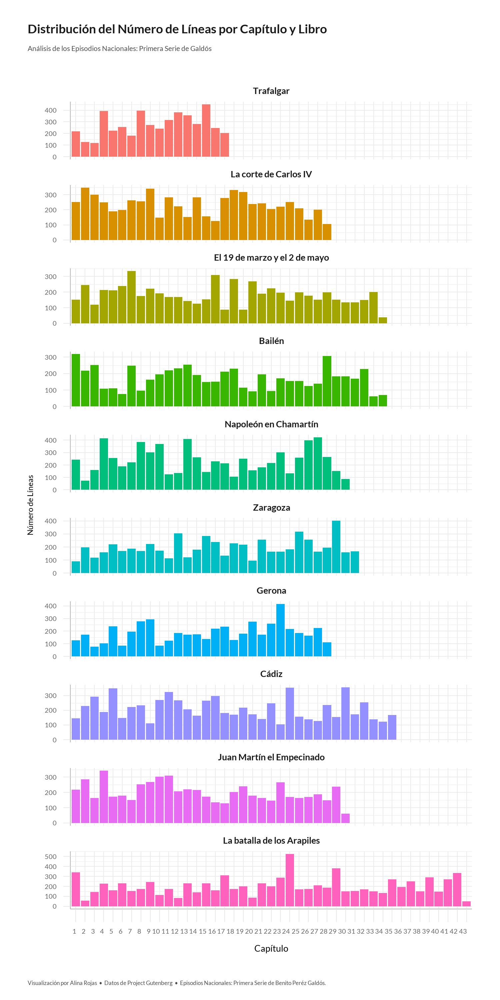
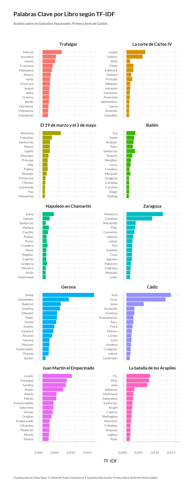
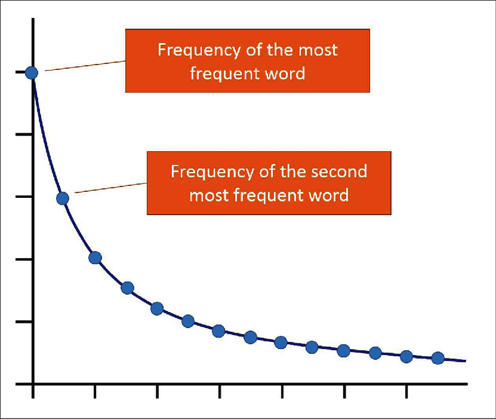
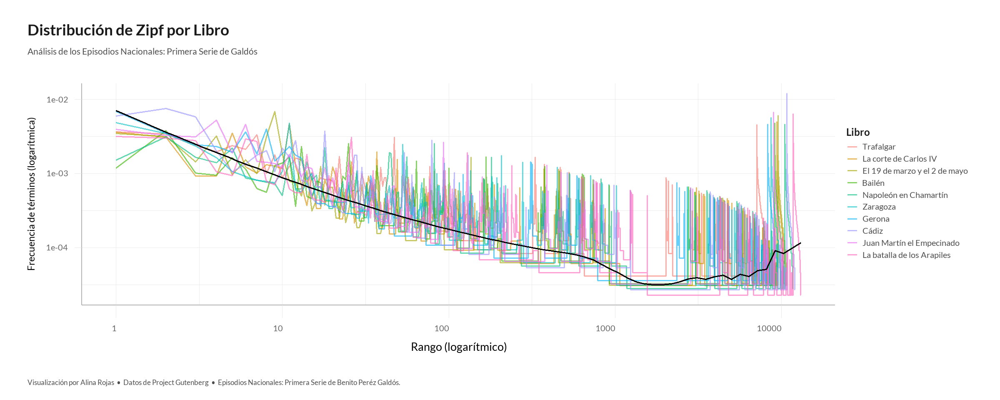
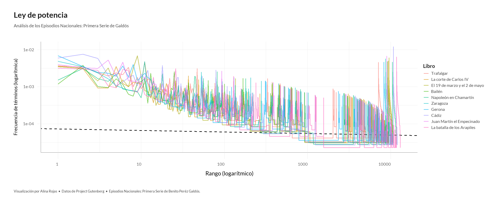
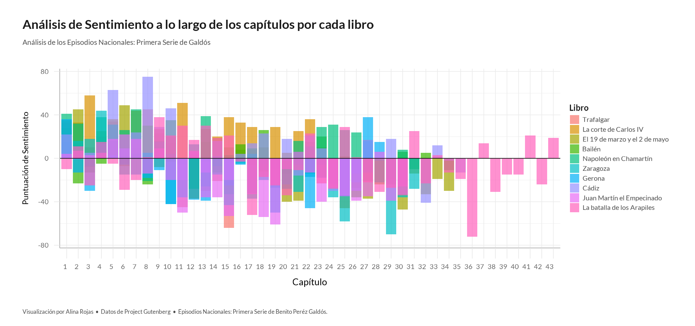
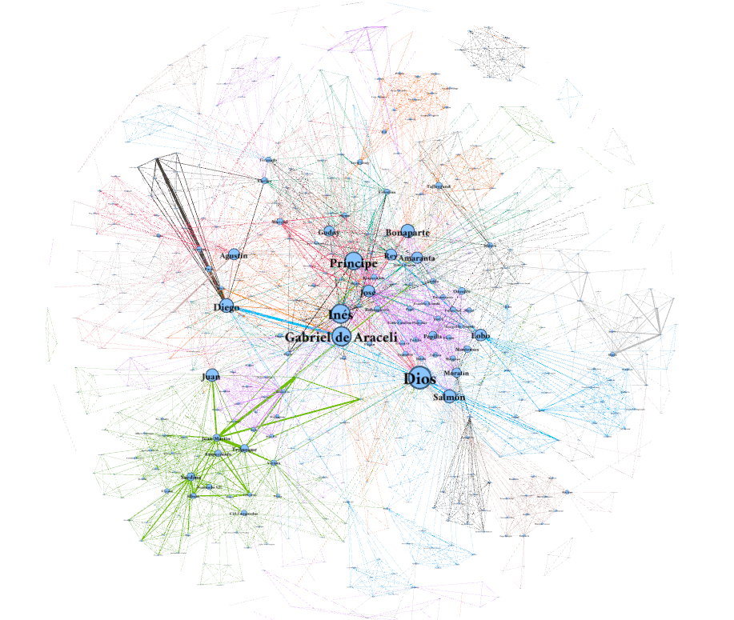
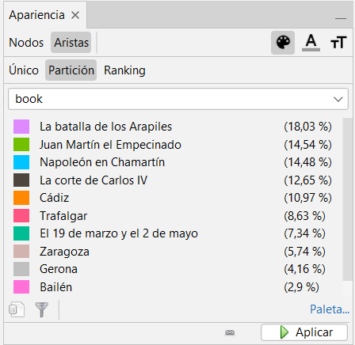
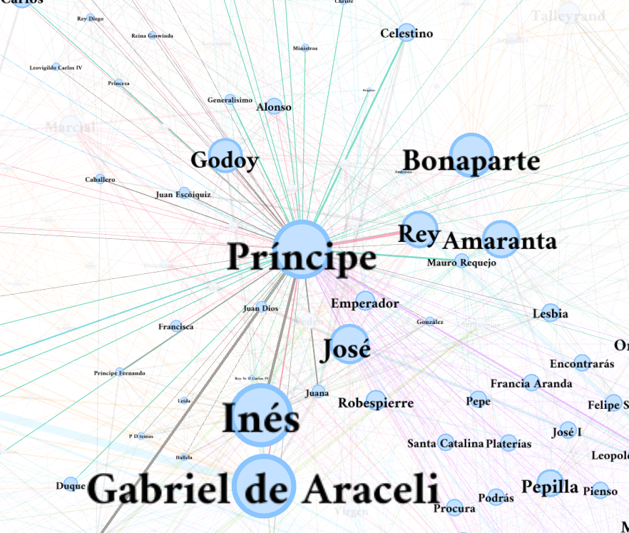

**Curso:** 3º MAIS

```{r setup, include=FALSE}
library(knitr)
knitr::opts_chunk$set(echo = TRUE)

## Cadena para la identificación de la enumeración de capítulos
roman_regex <- "^-?(I|II|III|IV|V|VI|VII|VIII|IX|X|XI|XII|XIII|XIV|XV|XVI|XVII|XVIII|XIX|XX|XXI|XXII|XXIII|XXIV|XXV|XXVI|XXVII|XXVIII|XXIX|XXX|XXXI|XXXII|XXXIII|XXXIV|XXXV|XXXVI|XXXVII|XXXVIII|XXXIX|XL|XLI|XLII|XLIII|XLIV|XLV|XLVI|XLVII|XLVIII|XLIX|L|LI|LII|LIII|LIV|LV|LVI|LVII|LVIII|LIX|LX|LXI|LXII|LXIII|LXIV|LXV|LXVI|LXVII|LXVIII|LXIX|LXX)-?$"

## Tema para las gráficas
# Cargar las librerías necesarias
library(ggplot2)
library(showtext)
library(ggtext)

# Configurar la fuente "Lato"
font_add_google("Lato", "lato")
showtext_auto()

# Establecer el tema global
theme_set(theme_minimal(base_family = "lato"))

# Actualizar el tema
theme_update(
  # Ejes visibles
  axis.line = element_line(color = "grey70", size = 0.6),  # Añadir líneas de los ejes X e Y en gris claro
  # Axes labels are grey
  axis.text = element_text(color = "grey40"),
  # The size of the axes labels are different for x and y.
  axis.text.x = element_text(size = 15, margin = margin(t = 10), hjust = 1),  # Rotar etiquetas del eje X
  axis.text.y = element_text(size = 15, margin = margin(r = 10)),  # Incrementar margen derecho
  # Titles for axes
  axis.title.x = element_text(size = 20, margin = margin(t = 15)),  # Incrementar margen superior del título del eje X
  axis.title.y = element_text(size = 17, margin = margin(r = 15)),  # Incrementar margen derecho del título del eje Y
  # Also, the ticks have a very light grey color
  axis.ticks = element_line(color = "grey91", size = 0.5),
  # The length of the axis ticks is increased.
  axis.ticks.length.x = unit(1.3, "lines"),
  axis.ticks.length.y = unit(0.7, "lines"),
  # Customize margin values (top, right, bottom, left)
  plot.margin = margin(20, 40, 20, 40),
  # Use a light grey color for the background of both the plot and the panel
  plot.background = element_rect(fill = "white", color = "white"),
  panel.background = element_rect(fill = "white", color = "white"),
  # Customize title appearance
  plot.title = element_text(
    color = "grey10", 
    size = 28, 
    face = "bold",
    margin = margin(t = 15)
  ),
  # Customize subtitle appearance
  plot.subtitle = element_text(
    color = "grey30", 
    size = 16,
    lineheight = 1.35,
    margin = margin(t = 15, b = 40)
  ),
  # Title and caption are going to be aligned
  plot.title.position = "plot",
  plot.caption.position = "plot",
  plot.caption = element_text(
    color = "grey30", 
    size = 13,
    lineheight = 1.2, 
    hjust = 0,
    margin = margin(t = 40) # Large margin on the top of the caption.
  ),
  legend.position = "right", 
  legend.title = element_text(color = "grey10", size = 18, face = "bold"), 
  legend.text = element_text(color = "grey30", size = 15), 
  legend.background = element_rect(fill = "white", color = "white"),
  # Customize facet title appearance
  strip.text.x = element_text(size = 20, face = "bold", margin = margin(t = 10, b = 10))

)


## Variables de leyendas de las gráficas
plot_subtitle = "Análisis de los Episodios Nacionales: Primera Serie de Galdós" 
plot_caption = "Visualización por Alina Rojas  •  Datos de Project Gutenberg  •  Episodios Nacionales: Primera Serie de Benito Peréz Galdós."

```

<p style="text-align: center;">

 <br>

<center><em>Retrato de Benito Pérez Galdós en 1894, por Joaquín Sorolla.</em></center>

</p>

# Introducción

El presente trabajo tiene como objetivo profundizar en el estudio de la primera serie de los *Episodios Nacionales* de Benito Pérez Galdós, una colección de novelas que relatan eventos clave de la historia de España entre 1805 y 1812, combinando de manera única la ficción con hechos históricos significativos.

Las novelas de esta serie son:

1.  **Trafalgar** (1873)
2.  **La corte de Carlos IV** (1873)
3.  **El 19 de marzo y el 2 de mayo** (1873)
4.  **Bailén** (1873)
5.  **Napoleón en Chamartín** (1874)
6.  **Zaragoza** (1874)
7.  **Gerona** (1874)
8.  **Cádiz** (1874)
9.  **Juan Martín el Empecinado** (1874)
10. **La batalla de los Arapiles** (1875)

Galdós, uno de los escritores más importantes de la literatura española del siglo XIX, utilizó estas obras para ofrecer una perspectiva crítica y detallada de la sociedad española de su tiempo, utilizando un enfoque que integra la historia con la ficción para explorar la condición humana y los cambios sociales.

**Objetivos del Trabajo:**

1.  **Análisis Textual Profundo de las Novelas de Galdós:** Este trabajo se centrará en un análisis de los textos utilizando técnicas avanzadas de minería de textos. A través de herramientas como Quanteda y TidyText, se explorarán temas recurrentes, la frecuencia de palabras y la evolución del tono y estilo en las novelas. Las técnicas utilizadas incluyen:

    -   Frecuencia de palabras representada en nubes de palabras (wordclouds) para visualizar las palabras más comunes.

    -   Gráfico del número de líneas por capítulo a lo largo de los libros.

    -   Análisis TF-IDF para evaluar la importancia de palabras clave por cada libro.

    -   Ley de Zipf para examinar la distribución de la frecuencia de las palabras.

    -   Modelado de temas (Topic Modeling) para identificar y extraer los principales tópicos abordados en las obras.

    -   Análisis de sentimiento para evaluar las emociones expresadas en los textos.

2.  **Análisis de Redes Sociales (SNA):** Crearemos una red social de personajes para analizar las relaciones y conexiones entre ellos en las novelas de Galdós. Esto ayudará a entender mejor la dinámica social y las interacciones entre los personajes.

Este análisis no solo pretende enriquecer la comprensión académica de las obras de Galdós, sino también proporcionar una metodología replicable para estudios literarios que combinen técnicas cuantitativas y cualitativas, fomentando un diálogo interdisciplinario entre la literatura y la ciencia de datos.

# Preparación de entorno

## Importar paquetes

```{r results='hide', message=FALSE, warning=FALSE}
# Paquetes para manipulación y análisis de datos
library(dplyr)            # Manipulación de datos
library(tidyverse)        # Colección de paquetes para ciencia de datos
library(tidyr)            # Herramientas para "tidy data" (datos ordenados)
library(stringr)          # Manipulación de cadenas de caracteres
library(forcats)          # Herramientas para trabajar con factores

# Paquetes específicos para análisis de texto
library(quanteda)         # Análisis cuantitativo de texto
library(quanteda.textplots) # Visualización de resultados de análisis de texto
library(tidytext)         # Procesamiento y análisis de texto ordenado
library(gutenbergr)       # Descarga de textos del Proyecto Gutenberg
library(wordcloud)        # Generación de nubes de palabras
library(textstem)         # Lematización y stemming de texto
library(syuzhet)          # Análisis de sentimientos y extracción de rasgos de narrativa

# Paquetes para visualización
library(ggplot2)          # Creación de gráficos
library(hrbrthemes)       # Temas y personalización de gráficos con ggplot2
library(gganimate)        # Animación de gráficos creados con ggplot2
library(magick)           # Manipulación y procesamiento de imágenes
library(showtext)         # Uso de fuentes personalizadas en gráficos
library(ggtext)           # Añadir y personalizar texto en gráficos ggplot2
library(gridExtra)        # Disposición de múltiples gráficos en una sola página

# Paquetes para modelado y análisis avanzado
library(topicmodels)      # Modelos de temas para análisis de texto
library(igraph)           # Análisis y visualización de grafos

```

## Seed

Se configura una semilla para la reproducibilidad de los gráficos.

```{r}
set.seed(200)
```

## Descargar los libros

Los libros de la primera serie de los *Episodios Nacionales* se obtuvieron a través del Proyecto Gutenberg, una biblioteca digital gratuita con una amplia colección de obras clásicas.

```{r}
# IDs de Gutenberg de la primera serie de Episodios Nacionales
galdos_books <- c(16961, 67155, 67189, 14311, 67360, 49433, 67415, 21906, 67705, 67817)
book_titles <- c("Trafalgar",
                 "La corte de Carlos IV",
                 "El 19 de marzo y el 2 de mayo", 
                 "Bailén",
                 "Napoleón en Chamartín",
                 "Zaragoza",
                 "Gerona",
                 "Cádiz", 
                 "Juan Martín el Empecinado",
                 "La batalla de los Arapiles")

# Descargar los textos
books_data <- lapply(galdos_books, gutenberg_download, meta_fields = "title")

# Asegurarse de asignar nombres a cada elemento de la lista según el título del libro
names(books_data) <- book_titles
```

## Preparar los datos

### Corregir codificación

```{r}
# Función para corregir la codificación de un texto específico
correct_encoding <- function(text) {
  iconv(text, from = "ISO-8859-1", to = "UTF-8")
}

# Lista de títulos de libros que requieren corrección de codificación
books_needing_correction <- c("Trafalgar", "Bailén", "Cádiz")

# Aplicar la corrección de codificación solo a los libros seleccionados
for (i in seq_along(books_data)) {
  if (names(books_data)[i] %in% books_needing_correction) {
    # Corregir la codificación del texto de los libros específicos
    books_data[[i]]$text <- sapply(books_data[[i]]$text, correct_encoding, USE.NAMES = FALSE)
  }
}

# Verificar que los nombres siguen siendo correctos después de la corrección
print(names(books_data))

```

### Preparar y procesar cada libro individualmente

```{r}
# Función para procesar cada libro
process_book <- function(book_data, title) {
  lines <- unlist(strsplit(book_data$text, "\n", fixed = TRUE))
  lines <- lines[lines != ""]  # Eliminar líneas vacías
  
  # Ampliando la expresión regular para capturar números romanos más grandes
  roman_regex <- "^-?(I|II|III|IV|V|VI|VII|VIII|IX|X|XI|XII|XIII|XIV|XV|XVI|XVII|XVIII|XIX|XX|XXI|XXII|XXIII|XXIV|XXV|XXVI|XXVII|XXVIII|XXIX|XXX|XXXI|XXXII|XXXIII|XXXIV|XXXV|XXXVI|XXXVII|XXXVIII|XXXIX|XL|XLI|XLII|XLIII|XLIV|XLV|XLVI|XLVII|XLVIII|XLIX|L|LI|LII|LIII|LIV|LV|LVI|LVII|LVIII|LIX|LX|LXI|LXII|LXIII|LXIV|LXV|LXVI|LXVII|LXVIII|LXIX|LXX)-?$"

  book_df <- data.frame(
    text = lines,
    book = rep(title, length(lines)),
    line_number = seq_along(lines),
    chapter = cumsum(grepl(roman_regex, lines, ignore.case = TRUE)),
    stringsAsFactors = FALSE
  )

  return(book_df)
}

# Aplicar la función a cada libro y combinar en un solo dataframe
books_metadata <- lapply(seq_along(books_data), function(i) {
  process_book(books_data[[i]], names(books_data)[i])
}) %>% bind_rows()


```

Comprobamos su estructura.

```{r}
# Comprobar la estructura
summary(books_metadata)

# Ver algunos de los datos
head(books_metadata)
tail(books_metadata)
```

Como podemos observar, todos aquellos textos que preceden al primer capítulo, tales como prólogos, son asignados el capítulo 0. Por lo que, para llevar a cabo un análisis riguroso sobre la obra galdosiana, vamos a omitir estos fragmentos, junto con el título de cada capítulo de enumeración romana.

```{r}
# Filtrar los textos que no son parte de los capítulos (chapter == 0)
# y eliminar líneas que son títulos de capítulos
books_metadata_filtered <- books_metadata %>%
  filter(chapter > 0) %>%  # Excluir textos antes del primer capítulo
  filter(!grepl(roman_regex, text))  # Excluir títulos de capítulos

# Ver algunos de los datos filtrados
head(books_metadata_filtered)
```

Se ha observado que en la edición de *Bailén* descargada, existe un último fragmento en el que se presentan más libros publicados por la misma editorial. Por tanto, vamos a eliminarlo de nuestros datos de estudio, para centrarnos únicamente en la obra de Galdós.

```{r}
# Identificar la línea donde comienza "TRADUCCIONES DE DIVERSAS OBRAS"
start_line <- which(books_metadata_filtered$book == "Bailén" & grepl("TRADUCCIONES DE DIVERSAS OBRAS", books_metadata_filtered$text))

# Filtrar el dataframe para excluir todas las líneas desde start_line en adelante para el libro "Bailén"
if (length(start_line) > 0) {
  start_line_value <- books_metadata_filtered$line_number[start_line]
  books_metadata_filtered <- books_metadata_filtered[!(books_metadata_filtered$book == "Bailén" & books_metadata_filtered$line_number >= start_line_value), ]
}
```

# Análisis de texto

## Frecuencia de palabras con wordcloud

Los *wordclouds* o nubes de palabras son excelentes recursos visuales para la visualización de la frecuencia de palabras en textos. Vamos a elaborar uno para todos los libros de estudio.

### Creación de corpus

```{r}
# Crear el corpus a partir del texto filtrado
corpus_books <- corpus(books_metadata_filtered$text, 
                       docvars = data.frame(book = books_metadata_filtered$book,
                                            line_number = books_metadata_filtered$line_number,
                                            chapter = books_metadata_filtered$chapter))

# Revisión del corpus
summary(corpus_books)
```

Limpieza de caracteres especiales.

```{r}
# Función para eliminar guiones no deseados y limpiar texto
clean_text <- function(text) {
  text <- gsub("\\s--", " ", text)  # Eliminar espacios seguidos de dos guiones
  gsub("^--", "", text)             # Eliminar dos guiones al inicio
}

# Aplicar limpieza al texto del corpus y crear un nuevo corpus con texto limpio
texts_cleaned <- sapply(as.character(corpus_books), clean_text)
corpus_books <- corpus(texts_cleaned)

```

### Tokens

```{r}
# Convertir el corpus en tokens y aplicar limpieza inicial
tokens_books <- quanteda::tokens(corpus_books, what = "word",
                       remove_numbers = TRUE, remove_punct = TRUE,
                       remove_symbols = TRUE, remove_separators = TRUE,
                       split_hyphens = TRUE)

# Aplicar una limpieza adicional para eliminar guiones y palabras vacías
tokens_books <- tokens_replace(tokens_books, pattern = c("^--$", "^-$", "^$"), replacement = c("", "", ""))
tokens_books <- tokens_remove(tokens_books, stopwords("es"))
tokens_books <- tokens_remove(tokens_books, c("--", "tal", "dijo", "dije", "pues", "--dije", "--dijo", "me", "--pregunté", "mismo", "tan", "puedo", "puede", "dije--", "si", "á", "va", "sé"))
```

```{r}
# Generamos una matriz de términos-documento para analizar la frecuencia de los tokens limpios en el dataset.
dfm_books <- dfm(tokens_books)

# Obtenemos las 100 palabras más frecuentes en el corpus para identificar los términos dominantes.
top_terms <- topfeatures(dfm_books, 100)

print(top_terms)
```

Un aspecto llamativo observado entre las palabras obtenidas es la presencia recurrente de una «d» solitaria. Esto no es casualidad, ya que en los textos ambientados en la España del siglo XIX, era común el uso de formas de cortesía. Por lo tanto, esa letra es una abreviación de «Don».

A continuación, se combinarán palabras para formar bigramas, trigramas y cuatrigramas con el fin de evaluar más detalladamente los temas y conceptos más frecuentes a lo largo de los textos. Con el contenido obtenido, se creará una *wordcloud*.

```{r}
# Creamos tokens de n-gramas, incluyendo bigramas, trigramas y cuatrigramas, 
# para identificar frases comunes y asociaciones frecuentes.
tokens_grams <- tokens_ngrams(tokens_books, n = 2:4)

# Convertimos los tokens de n-gramas en una matriz de términos-documento para facilitar el análisis.
dfm_grams <- dfm(tokens_grams)

# Extraemos las 200 palabras o combinaciones de palabras más frecuentes para análisis posterior.
topfeatures(dfm_grams, 200)

```

### Elaboración de wordcloud

```{r message=FALSE, warning=FALSE, results='hide'}
# Nombre del archivo
filename <- "src/graphics/00_wordcloud_primera_serie.png"

# Configuración para guardar el gráfico
png(filename,
    width=3000,
    height=3000,
    bg = "black"
)

# Generar el wordcloud
textplot_wordcloud(dfm_grams, 
                   min_count = 10, 
                   random_order = FALSE,
                   rotation = 0,
                   color = brewer.pal(8, "Set3"))

# Cerrar el dispositivo de gráficos
dev.off()
```

```{r echo=FALSE, message=FALSE, warning=FALSE}
# Muestra el gráfico
include_graphics(filename)
```

### Interpretación del wordcloud

El wordcloud generado a partir de la primera serie de los *Episodios Nacionales* y el análisis de términos frecuentes revelan aspectos cruciales sobre los temas y personajes centrales de la serie:

1.  **Prominencia de Personajes**: Nombres como «Lord Gray», «Doña María», «Juan Martín» y «Mosén Antón» indican personajes recurrentes y centrales. Estos personajes probablemente juegan roles clave en el desarrollo de la trama y en la representación de las diversas facciones sociales y políticas de la época.

2.  **Importancia de los Diálogos**: Las frecuentes apariciones de palabras como «dijo», «preguntó», y «respondió» reflejan un estilo narrativo que se basa mucho en diálogos. Esto sugiere que las conversaciones entre personajes son un vehículo principal para el avance de la trama y la exposición de ideas.

3.  **Elementos de Interacción Social y Política**: La presencia de términos como «Sr.», «Don», «Doña», y otros títulos denotan un fuerte enfoque en las clases sociales y la estructura de poder. Además, las interacciones entre estos personajes podrían reflejar las dinámicas sociales y políticas de la España del siglo XIX.

4.  **Contexto Histórico y Militar**: Palabras como «capitán», «general», y «batalla» sugieren que las novelas tienen un fuerte componente histórico y militar, probablemente reflejando los conflictos bélicos de la época, como la Guerra de Independencia Española.

5.  **Dimensiones Emocionales y Humanas**: Frases como «mismo tiempo», «alguna vez», «puede ser», y «misma noche» indican una exploración de las emociones y pensamientos internos de los personajes, proporcionando profundidad psicológica y temporal a la narración.

6.  **Uso de Localizaciones y Tiempo**: La mención de lugares y tiempos específicos («aquel día», «cada vez», «largo tiempo») ayuda a establecer el escenario y avanza la ambientación de las historias.

Este análisis sugiere que Galdós utiliza sus *Episodios Nacionales* no solo para contar historias de individuos particulares sino para ofrecer una visión panorámica y crítica de la sociedad española en momentos de crisis y cambio. La frecuencia y la prominencia de ciertos nombres y temas en la nube de palabras proporcionan una ventana a las prioridades narrativas y temáticas del autor, ofreciendo una herramienta útil para entender cómo se entretejen personajes y eventos históricos en el lienzo más amplio de la historia española narrada por Galdós.

## Número de líneas por capítulo y libro

En este apartado, se realiza un análisis exploratorio de datos para comprender la distribución del número de líneas en cada capítulo de los libros de estudio. Este análisis permite identificar patrones en la estructura de los textos y proporciona una visión general de cómo están organizados los capítulos en términos de longitud. Para ello, se utiliza una visualización gráfica que muestra la cantidad de líneas por capítulo en cada libro, facilitando la identificación de variaciones y tendencias a lo largo de la obra.

```{r results='hide', message=FALSE, warning=FALSE}
# Ordenar los datos según el orden de la primera serie en el array book_titles
books_metadata_filtered$book <- factor(books_metadata_filtered$book, levels = book_titles)

# Crear un gráfico de barras para visualizar la distribución de los capítulos por libro
plot <- ggplot(books_metadata_filtered, 
        aes(x = as.factor(chapter), fill = book)) +  # Convertir la variable 'chapter' a factor para una mejor visualización
        geom_bar(show.legend = FALSE) +  # Crear un diagrama de barras sin leyenda
        labs(x = "Capítulo",
             y = "Número de Líneas",
             title = "Distribución del Número de Líneas por Capítulo y Libro",
             subtitle = plot_subtitle,
             caption = plot_caption,
             fill = "Libro") +
        facet_wrap(~book, ncol = 1, scales = "free_y")

# Guardar el gráfico como un archivo PNG
png("src/graphics/01_num_lineas_capitulo.png", height = 20, width = 10, units = "in", res = 150)
print(plot)
dev.off()
```

```{r echo=FALSE}

```

### Análisis del gráfico

El gráfico que se presenta muestra la distribución del número de líneas por capítulo en cada uno de los libros de la primera serie de los *Episodios Nacionales* de Benito Pérez Galdós. Como se puede observar, existe una gran variabilidad en la extensión de los capítulos, que oscila entre las 100 y las 400 líneas.

**Brevedad de la primera obra de la serie**

La primera obra de la serie, *Trafalgar*, es la que presenta los capítulos más breves, con una media de 200 líneas. Esta brevedad se puede explicar por varios motivos:

-   **Inmadurez del autor:** En el momento en que Galdós escribió *Trafalgar*, se encontraba en las etapas iniciales de su trayectoria literaria. Aún no había desarrollado completamente su estilo narrativo distintivo ni empleaba técnicas literarias avanzadas.

-   **Publicación por entregas:** *Trafalgar* fue publicado en formato de folletín, lo que requería que Galdós mantuviera una tensión constante en la narrativa y limitara la longitud de los capítulos para mantener el interés del lector.

-   **Enfoque temático:** La trama de *Trafalgar* se enfoca en la conocida batalla naval homónima. La sencillez de este tema permite una exploración directa sin necesidad de un desarrollo profundo.

**Gran extensión de la última obra de la serie**

La longitud de *La batalla de los Arapiles* se atribuye a varios factores:

- **Punto culminante de su carrera:** Redactada en 1875, esta obra señala un período de madurez en la carrera de Galdós, donde domina plenamente su estilo narrativo y las técnicas literarias.

- **Libertad en la narrativa:** Aunque *La batalla de los Arapiles* es la última obra de la primera serie, Galdós no enfrentó la presión de concluir toda la serie de manera apresurada y satisfactoria para el público, lo que le permitió explorar la narrativa con mayor profundidad.

- **Temática detallada:** Este libro aborda uno de los episodios clave de la Guerra de la Independencia Española. Galdós explora con profundidad las dimensiones políticas, militares y sociales de este evento.

- **Diversidad de personajes:** La novela introduce una variedad de personajes, tanto históricos como ficticios, dedicando tiempo significativo a desarrollar cada uno y sus interacciones.

- **Recreación de la batalla:** La descripción de la batalla es meticulosa y utiliza diversas técnicas narrativas para captar el caos y la intensidad del combate.

**Conclusiones sobre la variabilidad en la serie**

El análisis del número de líneas por capítulo en la primera serie de *Episodios Nacionales* muestra una notable variabilidad en la longitud de los capítulos. Esto se explica por factores como la madurez del autor, la libertad creativa, la complejidad de los temas, la cantidad de personajes y la profundidad de la trama.

*La batalla de los Arapiles*, destacando por su temática compleja y madurez narrativa, es la obra más extensa de la serie. Por contraste, *Trafalgar*, escrita en las primeras etapas de la carrera de Galdós y con una trama más simple, resulta ser la más breve.

**Consideraciones adicionales**

Además de los elementos analizados, es crucial considerar que la longitud de las obras literarias también puede influirse por la complejidad de la trama, la profundidad en la caracterización de los personajes y la riqueza en las descripciones ambientales. En el caso de *Episodios Nacionales*, como serie de novelas históricas, Galdós incorporó una considerable cantidad de información factual, lo cual también pudo contribuir al aumento en la extensión de las obras.

## Aplicación del estadístico TF-IDF y la ley de Zipf

### Cálculo de TF-IDF

El estadístico TF-IDF (frecuencia de término - frecuencia inversa de documento) está diseñado para medir la importancia de una palabra en un documento dentro de una colección (o corpus) de documentos. Esta medida tiene en cuenta dos aspectos importantes:

-   **Frecuencia de término (TF)**: Esto evalúa qué tan frecuentemente aparece una palabra específica en un documento en comparación con el total de palabras en ese documento. Cuanto más frecuente sea una palabra en un documento, mayor será su puntaje de TF para ese documento.

-   **Frecuencia inversa de documento (IDF)**: Este aspecto considera qué tan común es una palabra en todos los documentos de la colección. Si una palabra es muy común en todos los documentos, su puntaje de IDF será bajo. Por otro lado, si una palabra es poco común y aparece solo en unos pocos documentos, su puntaje de idf será alto.

En este caso, los documentos son los libros de la primera serie de *Episodios Nacionales*.

```{r}
# Convertir los tokens en un dataframe para cálculo de TF-IDF
words_df <- tokens_books %>%
  unlist(use.names = FALSE) %>%
  enframe(name = NULL, value = "word") %>%
  mutate(document = rep(books_metadata_filtered$book, times = lengths(tokens_books))) # Asegura la correspondencia directa durante la creación del dataframe

# Continuar con el filtrado para limpieza
words_df <- words_df %>%
  filter(str_detect(word, "^[a-zA-ZáéíóúÁÉÍÓÚñÑüÜ]+$")) %>%  # Solo caracteres alfabéticos
  filter(nchar(word) > 1) %>%  # Excluir palabras de un solo carácter
  filter(!word %in% c("ví", "fué", "dió", "tí", "dijo", "fue", "dio", "hizo", "tuvo", "vino", "dio", "vió", "pudo", "quedó", "salió", "sólo", "ésta")) # Excluir verbos comunes y otras palabras no significativas

# Calcular frecuencias de término
word_counts <- words_df %>%
  count(document, word, sort = TRUE)

# Unir con el total de palabras por documento para el cálculo de TF-IDF
total_words <- word_counts %>%
  group_by(document) %>%
  summarize(total = sum(n))

# Calcular TF-IDF
tf_idf <- word_counts %>%
  bind_tf_idf(word, document, n) %>%
  arrange(desc(tf_idf))

# Suponiendo que 'n' es el conteo de términos y que necesitamos calcular el total de términos por documento
total_words_per_document <- tf_idf %>%
  group_by(document) %>%
  summarize(total = sum(n))

# Añadir esta información de nuevo a tf_idf para calcular frecuencias relativas
tf_idf <- tf_idf %>%
  left_join(total_words_per_document, by = "document")

# Mostrar las palabras con mayor TF-IDF
head(tf_idf, 200)

```

#### Visualización de Palabras Clave con TF-IDF

```{r}
# Filtrar para mostrar solo las 15 palabras más relevantes por libro
top_tf_idf_terms <- tf_idf %>%
  group_by(document) %>%
  slice_max(tf_idf, n = 15, with_ties = FALSE) %>%
  ungroup()
```

```{r results='hide', message=FALSE, warning=FALSE}
# Crear un gráfico de barras horizontal ajustado para la visualización
plot <- ggplot(top_tf_idf_terms, aes(x = tf_idf, y = fct_reorder(word, tf_idf), fill = document)) +
  geom_col(show.legend = FALSE) +
  facet_wrap(~ document, ncol = 2, scales = "free_y") +  # Ajuste para dos columnas, escalas libres
  labs(x = "TF-IDF",
       y = NULL,
       title = "Palabras Clave por Libro según TF-IDF",
       subtitle = "Análisis sobre los Episodios Nacionales: Primera Serie de Galdós",
       caption = plot_caption)

# Guardar el gráfico
png("src/graphics/03_tfidf_palabras.png", width = 8, height = 20, units = "in", res = 150)
print(plot)
dev.off()
```

```{r echo=FALSE}

```

#### Análisis del gráfico

El gráfico *Palabras clave por libro según TF-IDF* obtenido de la primera serie de los *Episodios Nacionales* de Benito Pérez Galdós ofrece una vista detallada sobre los **términos más distintivos** de cada libro, proporcionando un reflejo de los temas y personajes que dominan cada volumen. Este análisis revela varias observaciones significativas sobre la serie:

1.  **Prominencia de Personajes**: La mayoría de los términos destacados son nombres propios, lo que indica una fuerte presencia de personajes definidos en la narrativa de Galdós. Por ejemplo, «Marcial», «Francisca» y «Churruca» en *Trafalgar* son claves en la trama que gira en torno a la famosa batalla naval.

2.  **Ubicaciones y Contexto Histórico**: En varios libros, aparecen nombres de lugares y eventos históricos, como «Gerona», «Zaragoza», y «La batalla de los Arapiles». Esto subraya el enfoque histórico de Galdós y su esfuerzo por anclar la ficción en contextos históricos reales y significativos.

3.  **Interacciones y Relaciones**: La presencia de nombres en asociación con otros nombres (como «Lord Gray» y «Doña Asunción» en «Cádiz») puede sugerir relaciones y dinámicas entre personajes, que son fundamentales para la trama de los libros.

4.  **Diversidad Temática**: Cada libro muestra un conjunto único de términos clave, lo que refleja la diversidad de temas y enfoques narrativos de Galdós en la serie. Por ejemplo, *El 19 de marzo y el 2 de mayo* se centra en personajes y temas específicos del levantamiento contra Napoleón, lo cual es distinto de los temas navales en *Trafalgar*.

5.  **Evolución de Personajes y Lugares**: El cambio en las palabras clave de un libro a otro también podría indicar la evolución de los personajes o el cambio de ubicaciones y temas centrales, lo cual es crucial para entender el desarrollo de la serie en su conjunto.

6.  **Campos Semánticos Relacionados**: Los términos clave identificados mediante el análisis TF-IDF tienden a seguir un campo semántico coherente con el contenido del libro. Por ejemplo, en *Trafalgar*, se destacan términos relacionados con la marina como «bordo», «navío», «marineros», y «tripulación», subrayando los temas marítimos y bélicos presentes en este volumen.

Este análisis TF-IDF no solo revela las palabras que son distintivas en cada texto, sino que también ayuda a comprender qué elementos son considerados centrales por el autor en cada parte de la serie. Observar cómo ciertos nombres aparecen en múltiples libros puede indicar personajes o temas recurrentes, mientras que la introducción de nuevos términos en libros posteriores puede reflejar la introducción de nuevos personajes o cambios en la dirección de la narrativa. Estos detalles son cruciales para estudios literarios más profundos que buscan explorar la estructura narrativa y el desarrollo temático en la obra de Galdós.

### Ley de Zipf

La ley de Zipf es un principio estadístico que destaca la regularidad en el uso de palabras dentro de un idioma. Esta ley predice que la frecuencia con la que una palabra aparece en un texto (o un conjunto de textos) es inversamente proporcional a su posición en la lista de frecuencia de palabras. En otras palabras, la palabra más común en un texto se usará aproximadamente el doble de veces que la segunda más común, tres veces más que la tercera más común, y así sucesivamente.

Este fenómeno se puede observar al trazar la frecuencia de las palabras frente a su rango de frecuencia; el resultado típicamente muestra una distribución hiperbólica. La ley lleva el nombre del lingüista George Zipf, quien fue uno de los primeros en describir este comportamiento.

{width="300"}

#### Análisis de frecuencia y rango

A continuación, calculamos la frecuencia de términos por libro y les asignamos un rango basado en esta frecuencia:

```{r, message=FALSE, warning=FALSE}
# Asignar el rango y la frecuencia de término por documento
freq_by_rank_books <- tf_idf %>%
  group_by(document) %>%
   mutate(rank = row_number(), 
         term_frequency = n/total) %>%
  ungroup()

freq_by_rank_books
```

#### Visualización de la distribución de Zipf

Al graficar el rango de cada término contra su frecuencia relativa, esperamos ver una relación aproximadamente lineal en una escala logarítmica, si es que los datos siguen la ley de Zipf.

```{r results='hide', message=FALSE, warning=FALSE}
# Visualización de la ley de Zipf para cada libro
plot <- ggplot(freq_by_rank_books, aes(x = rank, y = term_frequency, color = document)) +
        geom_line(linewidth = 1.1,
                  alpha = 0.6) +  # Reducir la opacidad de las líneas originales para menos distracción
        geom_smooth(method = "loess",  # Método de suavizado local
                    span = 0.2,  # El tamaño del "ventanal" para suavizar
                    se = FALSE,  # No incluir la banda de error estándar
                    color = "black") +  # Color de la línea suavizada
        scale_x_log10() +
        scale_y_log10() +
        labs(title = "Distribución de Zipf por Libro",
             subtitle = plot_subtitle,
             caption = plot_caption,
             x = "Rango (logarítmico)",
             y = "Frecuencia de términos (logarítmica)",
             color = "Libro") 

# Guardar el gráfico
png("src/graphics/04_ley_zipf.png", width = 20, height = 8, units = "in", res = 120)
print(plot)
dev.off()
```

```{r echo=FALSE}

```

El gráfico *Distribución de Zipf por Libro en Episodios Nacionales* exhibe la relación entre el rango y la frecuencia de términos para cada libro de la primera serie de los *Episodios Nacionales* de Benito Pérez Galdós, utilizando una escala logarítmica para ambos ejes. Esta visualización permite analizar la distribución de los términos y cómo se ajustan a la ley de Zipf, destacando particularmente las desviaciones de esta ley, como las mesetas y picos, que son cruciales para entender la dinámica lingüística y narrativa de cada volumen.

#### Análisis del gráfico

**Desviaciones de la Ley de Zipf: Mesetas y Picos**

- **Presencia de Mesetas y Picos**: En el gráfico, notamos varias mesetas y picos a lo largo de las líneas que representan cada libro. Las mesetas sugieren períodos donde varios términos comparten frecuencias similares, lo que podría vincularse con la introducción recurrente de temas o personajes que predominan en ciertas partes de los libros. Por otro lado, los picos podrían indicar términos que, aunque no predominan en todo el texto, adquieren una relevancia particular en contextos específicos.

- **Relevancia Temática y Narrativa**: Las mesetas y picos reflejan la riqueza temática y la complejidad narrativa en la obra de Galdós. Los términos que aparecen con alta frecuencia en determinados capítulos o secciones pueden estar relacionados con eventos clave o personajes centrales en esos momentos de la narración.

**Contexto y Variabilidad entre Libros**

- **Diversidad en el Uso de Palabras**: La forma y pendiente variadas de las líneas de cada libro demuestran diferencias en el estilo narrativo y la densidad temática de Galdós. El autor adapta su vocabulario según las exigencias narrativas de cada libro, lo que se manifiesta en cómo algunos términos varían en frecuencia en comparación con otros.

- **Línea `geom_smooth`**: La línea suavizada (`geom_smooth`) facilita la visualización de una tendencia general a lo largo de todos los libros, indicando un patrón común en el uso del lenguaje conforme a la ley de Zipf. Sin embargo, es crucial observar las desviaciones respecto a esta línea para una mejor comprensión de las peculiaridades de cada texto.

**Conclusión**

Este análisis enfatiza que las desviaciones de la ley de Zipf, observadas como mesetas y picos en la distribución de términos, son fundamentales para comprender la estructura lingüística y narrativa de los *Episodios Nacionales*. Estas desviaciones, que son más prominentes en las frecuencias de nombres propios, revelan cómo Galdós adapta su narrativa para incorporar eventos históricos clave y figuras relevantes. Este patrón en los nombres propios sugiere que Galdós se desvía de la distribución típica de términos para dar relevancia a personajes y lugares significativos en el contexto histórico de sus obras, lo que enriquece la trama y aporta profundidad a su recreación de la historia española.

#### Ley de Potencia

La ley de potencia es una herramienta crucial para entender la distribución de términos en un texto. Esta ley establece que la frecuencia de uso de una palabra es inversamente proporcional a su rango en la lista de palabras ordenadas por frecuencia, es decir, las palabras más comunes aparecen mucho más a menudo que las palabras menos comunes. 

La ley de Zipf es un caso particular de la ley de potencia aplicado específicamente a la frecuencia de las palabras en un lenguaje natural. Después de calcular y representar la ley de Zipf, es útil analizar la ley de potencia para proporcionar un marco más general y comparativo de cómo se distribuyen las palabras en los textos. Esto nos permite identificar desviaciones y particularidades en el uso del lenguaje dentro de los textos analizados.

En el contexto de los *Episodios Nacionales* de Benito Pérez Galdós, la representación de la ley de potencia nos ayuda a identificar la tendencia decreciente en la frecuencia de uso de las palabras y a observar cómo estas frecuencias se ajustan a un modelo de distribución esperado. A continuación, se presenta un análisis detallado de esta distribución utilizando una regresión lineal en una escala log-log.

```{r, message=FALSE, warning=FALSE}
zipf <- lm(log10(term_frequency) ~ log10(rank), 
   data = freq_by_rank_books)

summary(zipf)
```

##### Visualización de la Ley de Potencia

En este gráfico, se muestra la relación entre el rango y la frecuencia de términos para cada libro de la serie, junto con una línea punteada negra que representa el ajuste de la ley de potencia. Esta visualización es esencial para comprender cómo la frecuencia de uso de las palabras se desvía de una distribución Zipf estándar y revela variaciones significativas entre los diferentes libros.

```{r results='hide', message=FALSE, warning=FALSE}
plot <- freq_by_rank_books %>% 
  ggplot(aes(rank, 
             term_frequency, 
             color = document)) + 
  geom_abline(intercept = -4.140672, 
              slope = -0.040962, 
              color = "black", linetype = 2, linewidth = 1.1) +
  geom_line(linewidth = 1.1, 
            alpha = 0.6) + 
  labs(title = "Ley de potencia",
       subtitle = plot_subtitle,
       caption = plot_caption,
       x = "Rango (logarítmico)",
       y = "Frecuencia de términos (logarítmica)",
       color = "Libro") +
  scale_x_log10() +
  scale_y_log10()

# Guardar el gráfico
png("src/graphics/05_ley_potencia.png", width = 20, height = 8, units = "in", res = 120)
print(plot)
dev.off()
```

```{r echo=FALSE}

```

##### Análisis del gráfico

1. **Tendencia General:**
   - La mayoría de las líneas de colores (que representan los diferentes libros) siguen una tendencia decreciente en el gráfico, lo cual es esperado según la ley de potencia. Esto indica que las palabras más frecuentes aparecen mucho más a menudo que las palabras menos frecuentes.

2. **Ajuste del Modelo de Potencia:**
   - La línea negra punteada representa el ajuste de la ley de potencia a través de una regresión lineal en una escala log-log. Este ajuste sirve como referencia para ver cómo las frecuencias de los términos de los libros se comparan con un modelo ideal de ley de potencia.

3. **Desviaciones Significativas:**
   - Es evidente que ninguna de las representaciones de los libros se adecúa perfectamente a la ley de potencia. La mayoría de las líneas de colores quedan por encima de la línea negra punteada en algunos rangos y por debajo en otros:
     - En los rangos más bajos (palabras más comunes), las frecuencias de términos suelen estar por encima de la línea negra, indicando un uso más frecuente de ciertos términos que el modelo predice.
     - En los rangos más altos (palabras menos comunes), las frecuencias tienden a estar por debajo de la línea negra, mostrando una menor diversidad de términos que la esperada por una ley de potencia pura.

4. **Implicaciones Narrativas y Estilísticas:**
   - Las desviaciones y variaciones en las frecuencias de términos sugieren diferencias significativas en el uso del lenguaje y la riqueza léxica entre los libros. Estas desviaciones pueden reflejar la adaptabilidad de Galdós a distintos contextos históricos y temáticos, y cómo esto influye en la diversidad y frecuencia del vocabulario utilizado.

**Conclusión**

El gráfico revela que la distribución de frecuencias de términos en los *Episodios Nacionales* no se ajusta perfectamente a la ley de potencia. La mayoría de las líneas de colores muestran desviaciones significativas respecto a la línea negra punteada. Estas desviaciones son indicativas de las peculiaridades en el uso del lenguaje y las diferencias estilísticas entre los distintos libros de la serie. Estas observaciones son esenciales para estudios literarios más profundos y para comprender mejor el estilo narrativo de Galdós, reflejando la prominencia de ciertos términos y la estructura narrativa particular de cada obra.

## Topic Modeling

Para analizar los temas principales de la primera serie de los *Episodios Nacionales*, se empezaron utilizando técnicas tradicionales de modelado temático como LDA (Latent Dirichlet Allocation) y LSA (Latent Semantic Analysis). Sin embargo, la predominancia de nombres propios en los textos, debido a su naturaleza novelística, limitó la efectividad de estos métodos. Por ello, se optó por utilizar BERTopic, un enfoque avanzado basado en BERT (Bidirectional Encoder Representations from Transformers).

BERTopic es una técnica de modelado temático que combina BERT para generar embeddings de alta calidad con clustering y reducción de dimensionalidad. En su arquitectura, BERTopic utiliza TF-IDF para crear representaciones más relevantes y contextuales de los términos. Esto permite identificar con mayor precisión los temas presentes en el texto, al tener en cuenta tanto la frecuencia de las palabras como su importancia relativa en el corpus.

La ventaja de aplicar BERTopic en este trabajo radica en su capacidad para captar matices semánticos y contextuales, superando las limitaciones de las técnicas tradicionales. Al incorporar TF-IDF, BERTopic mejora la diferenciación entre términos comunes y específicos, lo que es especialmente útil en textos literarios donde los nombres propios y las descripciones detalladas son abundantes.

Este enfoque fue implementado en el notebook de Python `02_Topicos_Models_Episodios_Nacionales.ipynb`, facilitando una mejor captura y comprensión de los temas subyacentes en las novelas, aprovechando las capacidades de BERT para manejar la complejidad lingüística de los textos literarios.

Primero, exportamos el dataframe para importarlo en el notebook Python.

```{r}
# Guardar el dataframe en un archivo CSV
write.csv(books_metadata_filtered, file = "src/csv/books_metadata_filtered.csv", row.names = FALSE)
```

A continuación, cargaremos los datos recopilados en dicho notebook.

```{r}
# Cargar los datos desde el archivo CSV
topic_info <- read.csv('src/csv/topic_models.csv')

# Mostrar los registros
topic_info
```

### Representación general

En esta sección se representarán las palabras que presentan mayo frecuencia según BERTopic, separando los tópicos por colores.

```{r message=FALSE, warning=FALSE, results='hide'}
# Definir la paleta de colores
palette <- brewer.pal(50, "Set3")

# Crear un vector de colores basado en topic_index
colors <- palette[topic_info$topic_index %% length(palette) + 1]

# Nombre del archivo
filename <- "src/graphics/06_wordcloud_topic_models.png"

# Configuración para guardar el gráfico
png(filename,
    width=3000,
    height=3000,
    bg = "black"
)

# Generar el wordcloud
wordcloud(words = topic_info$word, 
          freq = topic_info$weight, 
          min.freq = 1, 
          scale = c(12, 2), # Ajustar la escala para aumentar el tamaño de las palabras más importantes
          colors = colors,
          random.order = FALSE,
          rot.per = 0.1,
          max.words = 200)

# Cerrar el dispositivo de gráficos
dev.off()
```

```{r echo=FALSE, message=FALSE, warning=FALSE}
# Mostrar el gráfico
include_graphics(filename)
```

Observamos una heterogeneidad de los tópicos entre las palabras de mayor frecuencia (aquellas de mayor tamaño). En el centro del mismo, donde se encuentran las palabras de mayor peso, se visualizan nombres de personajes principales, tales como Gabriel, Amaranta o Santorcaz, y términos relevantes, como «guerra» y «heridos», debido al carácter bélico de las novelas, o «corazón» y «madre» por la trama en la que se ven envueltos los personajes de la obra.

### Representación por tópicos

En este apartado se mostrará una nube de palabras para cada tópico, donde el tamaño de cada palabra será proporcional a su peso.

```{r message=FALSE, warning=FALSE}
# Seleccionar los 9 tópicos principales basados en el peso (weight)
top_topics <- topic_info %>%
  arrange(desc(weight)) %>%
  distinct(topic_index, .keep_all = TRUE) %>%
  head(9) %>%
  pull(topic_index)

top_topics
```

```{r message=FALSE, warning=FALSE}
# Filtrar los datos para los tópicos principales
filtered_data <- topic_info %>%
  filter(topic_index %in% top_topics)

filtered_data
```

```{r eval='hide', message=FALSE, warning=FALSE}
# Crear el layout y guardar la imagen en un archivo
filename <- "src/graphics/07_topic_models_wordclouds.png"
png(filename = filename,
    width = 3000,
    height = 3000,
    res = 300)

# Configurar el layout de la gráfica dentro del bloque de guardado
n_topics <- length(top_topics)
n_cols <- ceiling(sqrt(n_topics))
n_rows <- ceiling(n_topics / n_cols)
par(mfrow = c(n_rows, n_cols),
    mar = c(0, 0, 2, 0),
    bg = "black")

# Crear nubes de palabras para cada tema
for (topic in top_topics) {
  topic_words <- subset(filtered_data, topic_index == topic)
  colors <- palette[topic %% length(palette) + 1]
  wordcloud(words = topic_words$word, 
            freq = topic_words$weight,  
            scale = c(10, 5), 
            colors = colors, 
            random.order = FALSE, 
            rot.per = 0.1, 
            max.words = 100)
  title(main = paste("Tópico", topic), col.main = "white", cex.main = 2)
}

dev.off()
```

```{r echo=FALSE, message=FALSE, warning=FALSE}
# Mostrar el gráfico guardado
include_graphics(filename)
```

### Análisis de tópicos

A partir de estos tópicos, que representan los más frecuentes y destacados en la primera serie de los *Episodios Nacionales* de Benito Pérez Galdós, podemos interpretar y contextualizar algunos de ellos de manera más detallada.

**Tópico 37 - Brutalidades de la Guerra**

-   El **Tópico 37** incluye palabras como «guerra», «asesinar» y «exterminio», reflejando la crudeza y brutalidad de los conflictos bélicos. En los *Episodios Nacionales*, Galdós no solo describe batallas, sino también explora cómo la guerra afecta profundamente a individuos y sociedades, marcando la vida de sus personajes con cicatrices duraderas.

**Tópico 34 - Santorcaz y sus Características Personales**

-   Este tópico menciona a «Santorcaz» junto a palabras como «pausa», «petulancia», «marcho» y «sorna». Estos términos sugieren aspectos de la personalidad de Santorcaz, posiblemente reflejando su actitud cínica o sarcástica y su forma de interactuar con otros personajes. La presencia de estas palabras puede indicar cómo Santorcaz emplea la ironía o el desdén como mecanismos defensivos o como formas de expresión en un entorno social y político complejo.

**Tópico 30 - Amaranta y sus Relaciones Sociales**

-   **Amaranta**, destacada con términos como «recibiré», «amigo» y «fascina», es un personaje cuyo impacto en la trama y otros personajes se destaca por su capacidad de influir y manipular las dinámicas sociales a su alrededor. Este tópico muestra cómo las relaciones interpersonales se entrelazan con la evolución de los personajes y los eventos narrativos.

**Tópico 36 - Gabriel y su Papel**

-   En el **Tópico 36**, las palabras seleccionadas como «despreciarás», «admira», «irás», junto con «Gabriel» y verbos en segunda persona como «vas», «vete», y «haces», sugieren un contexto de interacción intensa y conflictiva, probablemente involucrando a Gabriel, el protagonista central de los *Episodios Nacionales* de Galdós. Este conjunto de términos refleja la tensión y las complejidades en las relaciones de Gabriel, especialmente en su trato con Amaranta, una figura significativa que frecuentemente desafía y cuestiona sus acciones y decisiones. Estas palabras podrían estar indicando escenas donde Gabriel es confrontado o desafiado por Amaranta, destacando la dinámica de poder y la interacción emocional entre ellos, que es crucial para entender las subtramas de influencia y manipulación personal dentro de la narrativa histórica y social de la obra.

**Tópico 35 - Emociones Profundas e Inés**

-   Este tópico incluye «corazones», «palpitar», «sentir», «oprimir» e «Inesilla», palabras que sugieren un enfoque en las emociones intensas y las experiencias sentimentales de los personajes. La inclusión de «Inesilla», el apodo cariñoso que Gabriel usa para su interés amoroso, destaca la importancia de su relación en la narrativa, subrayando cómo el amor y los lazos afectivos pueden ofrecer consuelo y comprensión en tiempos de adversidad.

**Tópico 48 - Impacto de la Guerra en la Salud y el Bienestar**

-   **El Tópico 48**, con términos como «heridos», «lamentaban», «curándole» y «enfermos», resalta el efecto devastador de la guerra en la salud física y emocional de los personajes. Este análisis sugiere cómo Galdós integra las consecuencias personales y colectivas de la guerra en su representación del impacto humano y social.

**Conclusión**

Estos tópicos, siendo los más frecuentes en los textos, proporcionan una visión amplia y diversa de la narrativa de Galdós. Los *Episodios Nacionales* de Galdós no solo capturan eventos históricos sino también proporcionan una introspección profunda en la psicología y moralidad de los personajes, explorando dilemas y desafíos contemporáneos. La representación de figuras históricas clave, junto con la exploración de temas universales como la devoción, el honor, y las relaciones interpersonales, permite a Galdós comentar sobre la condición humana mientras pinta meticulosamente la historia y la sociedad españolas.

## Análisis de Sentimiento

El análisis de sentimiento es una técnica poderosa utilizada para comprender las emociones y actitudes expresadas en un texto. Esta técnica asigna una puntuación numérica a las palabras o frases, indicando si el sentimiento expresado es positivo, negativo o neutral. En este apartado, se aplicará el análisis de sentimiento a los textos de la serie *Episodios Nacionales* de Benito Pérez Galdós.

Utilizando la biblioteca `syuzhet`, se evaluarán los sentimientos a lo largo de los capítulos de cada libro. `syuzhet` analiza el texto y asigna una puntuación de sentimiento basada en un rango numérico donde las palabras positivas tienen una puntuación alta y las palabras negativas tienen una puntuación baja. La puntuación de sentimiento para cada capítulo se calculará restando el número de palabras con connotación negativa del número de palabras con connotación positiva, generando así un valor neto que refleja el tono emocional de ese capítulo.

Este enfoque permitirá identificar patrones emocionales y detectar momentos clave en la narrativa donde se intensifican las emociones positivas o negativas.

A continuación, se presentan los pasos para realizar este análisis, seguido de una visualización que muestra cómo los sentimientos evolucionan a lo largo de los capítulos en cada libro.

```{r eval='hide'}
# Función para realizar el análisis de sentimiento en cada texto
get_sentiment_scores <- function(text) {
  # Obtener los sentimientos utilizando la biblioteca syuzhet
  sentiments <- get_nrc_sentiment(text, language = "spanish")
  
  # Calcular el sentimiento positivo y negativo
  sentiment_score <- sum(sentiments$positive) - sum(sentiments$negative)
  return(sentiment_score)
}

# Aplicar el análisis de sentimiento a cada capítulo
books_metadata_sentiment <- books_metadata_filtered %>%
  group_by(book, chapter) %>%
  summarise(text = paste(text, collapse = " ")) %>%
  mutate(sentiment = sapply(text, get_sentiment_scores))

# Ver las primeras filas con el análisis de sentimiento
head(books_metadata_sentiment)

```

Representamos gráficamente los resultados obtenidos del análisis de sentimientos por cada capítulo de cada libro.

```{r eval='hide', message=FALSE, warning=FALSE}
# Crear un gráfico de barras apiladas para visualizar el sentimiento a lo largo de los capítulos de cada libro
plot <- ggplot(books_metadata_sentiment,
               aes(x = as.factor(chapter),
                   y = sentiment,
                   fill = book)) +
        geom_col(position = "identity", alpha = 0.7) +
        geom_hline(yintercept = 0, linetype = "solid", color = "black") +  # Añadir la línea en y = 0
        scale_y_continuous(limits = c(-75, 75)) +
        labs(title = "Análisis de Sentimiento a lo largo de los capítulos por cada libro",
             subtitle = plot_subtitle,
             caption = plot_caption,
             x = "Capítulo",
             y = "Puntuación de Sentimiento",
             fill = "Libro")

# Guardar el gráfico
ggsave("src/graphics/08_analisis_sentimiento.png", plot, width = 17, height = 8, units = "in", dpi = 120)

```

```{r echo=FALSE}

```

```{r eval='hide', message=FALSE, warning=FALSE}
# Crear el gráfico animado
plot <- ggplot(books_metadata_sentiment,
               aes(x = as.factor(chapter),
                   y = sentiment,
                   fill = book)) +
        geom_col(position = "identity") +
        geom_hline(yintercept = 0, linetype = "solid", color = "black") +  # Añadir la línea en y = 0
        scale_y_continuous(limits = c(-75, 75)) +
        labs(title = "Análisis de Sentimiento a lo largo de los capítulos de {closest_state}",
             caption = plot_caption,
             subtitle = plot_subtitle,
             x = "Capítulo",
             y = "Puntuación de Sentimiento",
             fill = "Libro") +
        transition_states(book,
                          transition_length = 2,
                          state_length = 6) +
        enter_fade() +
        exit_shrink() +
        ease_aes('sine-in-out')

# Crear la animación
animation <- animate(plot, width = 17, height = 8, units = "in", res = 120)
anim_save("src/graphics/09_analisis_sentimiento_libro.gif", animation)

```

```{r echo=FALSE}
include_graphics("src/graphics/09_analisis_sentimiento_libro.gif")
```

### Interpretación de las gráficas

1.  **Trafalgar**

    -   El análisis de sentimiento para *Trafalgar* muestra un patrón notable. Los primeros capítulos tienen un predominio de sentimientos positivos, probablemente reflejando la preparación y las expectativas antes de la batalla. Sin embargo, conforme avanza la narrativa y se desarrollan los eventos de la batalla, los sentimientos negativos se vuelven más prominentes, lo que sugiere un cambio en el tono narrativo hacia un mayor pesimismo y la descripción de los horrores de la guerra.

2.  **La corte de Carlos IV**

    -   En *La corte de Carlos IV*, observamos una mayor variabilidad en los sentimientos a lo largo de los capítulos. Hay una mezcla de capítulos con sentimientos positivos y negativos, lo que puede indicar una narrativa que alterna entre momentos de esperanza y desilusión en el contexto de la corte y los eventos políticos de la época.

3.  **El 19 de marzo y el 2 de mayo**

    -   *El 19 de marzo y el 2 de mayo* muestra una tendencia general hacia sentimientos negativos, especialmente en los capítulos centrales. Esto puede estar relacionado con la descripción de los eventos trágicos y la represión durante los levantamientos contra Napoleón. La narrativa parece reflejar el dolor y la lucha de los personajes en un contexto de conflicto.

4.  **Bailén**

    -   El análisis de *Bailén* muestra una alternancia entre sentimientos positivos y negativos a lo largo de los capítulos. Este patrón sugiere que la narrativa puede estar describiendo tanto los triunfos como las dificultades de la batalla, capturando la complejidad emocional de los eventos históricos.

5.  **Napoleón en Chamartín**

    -   En *Napoleón en Chamartín*, se observa una variabilidad considerable en los sentimientos. Los primeros capítulos están dominados por sentimientos positivos, que pueden reflejar la estrategia y los planes iniciales de Napoleón. Sin embargo, conforme la narrativa avanza, los sentimientos negativos se incrementan, lo que podría estar relacionado con las descripciones de los enfrentamientos y las dificultades de la campaña. Este patrón sugiere una narrativa que equilibra la exaltación inicial con las complicaciones posteriores.

6.  **Zaragoza**

    -   En *Zaragoza*, se observa una predominancia de sentimientos negativos, especialmente en los capítulos finales. Esto es consistente con la narrativa de un sitio prolongado y la eventual caída de la ciudad, que probablemente esté marcada por descripciones de sufrimiento y resistencia heroica.

7.  **Gerona**

    -   El sentimiento en *Gerona* es predominantemente negativo, con pocos capítulos mostrando puntuaciones positivas significativas. Este patrón es coherente con la historia de un sitio prolongado y los duros enfrentamientos, resaltando la desesperación y el sacrificio de los personajes.

8.  **Cádiz**

    -   *Cádiz* presenta una variabilidad significativa en los sentimientos a lo largo de los capítulos, aunque con una tendencia a equilibrar los sentimientos positivos y negativos. Esto podría reflejar una narrativa que aborda tanto los desafíos como las esperanzas de los personajes en un contexto de cambios políticos y sociales.

9.  **Juan Martín el Empecinado**

    -   El análisis de *Juan Martín el Empecinado* muestra un predominio de sentimientos negativos, especialmente en los capítulos medios. Esto puede reflejar la lucha continua y las dificultades enfrentadas por el protagonista en su resistencia contra las fuerzas napoleónicas.

10. **La batalla de los Arapiles**

    -   *La batalla de los Arapiles* muestra una variabilidad significativa en los sentimientos a lo largo de los capítulos, con picos tanto positivos como negativos. Esto sugiere una narrativa que alterna entre la descripción de victorias y derrotas, capturando la complejidad emocional de la batalla.

**Conclusión**

En resumen, el análisis de sentimiento a lo largo de los capítulos de cada libro de los *Episodios Nacionales* de Benito Pérez Galdós revela patrones que están estrechamente vinculados a los eventos históricos y contextos narrativos de cada obra. La presencia de sentimientos positivos y negativos refleja la complejidad emocional y los desafíos enfrentados por los personajes, proporcionando una visión profunda de las dinámicas narrativas y temáticas de la serie.

## Conclusión del Análisis de Text Mining

El análisis de minería de texto realizado sobre la primera serie de los *Episodios Nacionales* de Benito Pérez Galdós ha proporcionado una visión detallada de las temáticas, personajes y estilos narrativos empleados por el autor. A través del uso de técnicas como el wordcloud y el análisis de frecuencia de términos, hemos podido extraer conclusiones significativas sobre la estructura y los elementos clave que definen esta serie de novelas históricas.

**Principales hallazgos**

1.  **Dominio de Personajes y Diálogos**: La prominencia de nombres propios en el wordcloud y la frecuencia de términos relacionados con el diálogo resaltan el enfoque narrativo de Galdós en el desarrollo de personajes complejos y en la utilización de conversaciones como motor principal de la trama.

2.  **Elementos Sociales y Políticos**: El análisis ha subrayado el fuerte componente social y político en las novelas, evidenciado por la frecuente aparición de títulos y nombres que reflejan la estructura de clases y la dinámica de poder de la época. Esto no solo enriquece la narrativa, sino que también ofrece una crítica de las tensiones sociales y políticas de la España del siglo XIX.

3.  **Contexto Histórico y Militar**: El uso destacado de términos militares y la referencia a eventos históricos específicos subrayan el compromiso de Galdós con la precisión histórica y su deseo de sumergir al lector en el contexto de las guerras que modelaron el destino de España.

4.  **Riqueza Temática y Narrativa**: El análisis ha revelado una rica diversidad temática, desde la guerra hasta las relaciones personales y la moralidad, lo que demuestra la habilidad de Galdós para tejer múltiples hilos narrativos en un tapiz complejo que no solo entretiene, sino que también educa y provoca reflexión.

Este análisis resalta cómo la minería de texto mejora el entendimiento de obras literarias al identificar técnicas y temas clave, mostrando su aplicación potencial en otros textos complejos. Para futuras investigaciones, incorporar técnicas avanzadas de procesamiento de lenguaje y aprendizaje automático podría mejorar aún más la interpretación y el análisis temático. En definitiva, la minería de texto ha permitido una exploración detallada de la narrativa de Galdós, revelando su profunda y educativa representación de la historia española.

# Análisis de Redes Sociales (SNA)

Los textos han sido procesados utilizando SpaCy y BERT para identificar nombres propios de personas, ya que ambos ofrecen capacidades avanzadas para el análisis de texto. SpaCy es una biblioteca de procesamiento de lenguaje natural en Python que permite realizar análisis sintácticos y semánticos de manera eficiente. Por su parte, BERT (Bidirectional Encoder Representations from Transformers) es un modelo avanzado de aprendizaje profundo que mejora la comprensión contextual en el reconocimiento de entidades. La combinación de estas herramientas nos asegura una identificación precisa y contextualizada de los personajes mencionados en los textos.

El objetivo es analizar las relaciones y conexiones entre los personajes detectados en los textos, facilitando una comprensión más profunda de la estructura social y las dinámicas de interacción presentes en la obra. Utilizaremos técnicas y herramientas de SNA para visualizar y explorar estas redes de personajes.

El método utilizado para establecer las relaciones entre personajes se basa en la co-ocurrencia de nombres en un mismo capítulo. Es decir, si los nombres de dos personajes se mencionan en el mismo capítulo, se considera que estos personajes están conectados. Este enfoque nos permite mapear las interacciones y asociaciones entre personajes dentro del contexto narrativo.

## Preparar los datos

El archivo CSV procesado en el notebook de Python es el mismo que se exportó en el apartado de Topic Modeling. Este archivo contiene los nombres de personajes detectados y sus relaciones, listos para ser utilizados en el análisis de redes sociales.

A continuación, cargaremos el archivo generado con los nombres de personajes detectados:

```{r}
# Cargar el archivo CSV
books_metadata_filtered_characters <- read.csv("src/csv/books_metadata_filtered_characters.csv")
```

```{r}
# Mostrar la estructura
summary(books_metadata_filtered_characters)
```

```{r}
load("src/es_stopwords.rda")
```

```{r}
# Función para procesar cada lista de nombres de personas
process_person_names <- function(person_names) {
  # Eliminar puntuaciones
  person_names <- str_replace_all(person_names, "[[:punct:]]", "")
  
  # Eliminar prefijos específicos
  person_names <- str_replace_all(person_names, "^(D |Don |Dª |Doña |Sr D |Sr |Sra )", "")
  
  # Eliminar stopwords de cada nombre excepto "de", y eliminar cadenas que se conviertan en vacías
  person_names <- sapply(person_names, function(name) {
    words <- str_split(name, " ")[[1]]
    # Filtrar las palabras que no son stopwords o que son "de"
    words <- words[!tolower(words) %in% es_stopwords | tolower(words) == "de"]
    name <- paste(words, collapse=" ")
    return(name)
  })
  
  # Eliminar elementos vacíos si la cadena entera es un stopword
  person_names <- person_names[person_names != ""]
  
  # Comprobar si la segunda palabra empieza con minúscula y no es "de"
  person_names <- sapply(person_names, function(name) {
    words <- str_split(name, " ")[[1]]
    if (length(words) > 1 && !grepl("^[Dd]e$", words[2]) && grepl("^[a-z]", words[2])) {
      return(words[1])
    } else {
      return(name)
    }
  })

  return(person_names)
}
```

```{r}
# Aplicar la función a la columna person_names
books_metadata_filtered_characters$person_names <- lapply(books_metadata_filtered_characters$person_names, function(x) {
  if (x != "[]") {
    # Quitar los corchetes y comas
    names_list <- str_replace_all(x, "[\\[\\]\"]", "")
    names_list <- str_split(names_list, ",")[[1]]
    names_list <- trimws(names_list)
    
    # Procesar los nombres
    processed_names <- process_person_names(names_list)
    
    # Convertir de nuevo a la representación de lista en cadena
    return(paste0("[", paste(shQuote(processed_names), collapse = ", "), "]"))
  } else {
    return(x)
  }
})

```

```{r}
# Mostrar el dataframe
books_metadata_filtered_characters
```

### Generar aristas

```{r}
# Transformar y limpiar la columna person_names
books_metadata_filtered_characters$person_names <- lapply(books_metadata_filtered_characters$person_names, function(x) {
  x <- unlist(str_split(str_replace_all(x, "[\\[\\]'']", ""), ",\\s*"))
  x <- str_replace_all(x, "&quot;", "")  # Eliminar entidades HTML de comillas dobles
  x <- str_replace_all(x, "\"", "")  # Eliminar comillas dobles adicionales
  x <- str_trim(x)  # Eliminar espacios en blanco adicionales
  x
})

# Filtrar entradas sin personajes o con un solo personaje
books_metadata_filtered_characters <- books_metadata_filtered_characters %>%
  mutate(person_names = lapply(person_names, unique)) %>%  # Asegura que los nombres sean únicos
  filter(lengths(person_names) > 1)

# Expandir la lista de personajes a filas individuales y asegurarse de que son únicos y no vacíos
long_data <- books_metadata_filtered_characters %>%
  unnest_longer(person_names) %>%
  distinct() %>%
  filter(person_names != "" & !is.na(person_names))  # Asegurar que no hay nombres vacíos o nulos

# Crear todas las combinaciones posibles de pares de personajes en el mismo capítulo y libro, evitando bucles
edges <- long_data %>%
  group_by(book, chapter) %>%
  filter(n() > 1) %>% 
  summarise(person_pairs = list(combn(person_names, 2, simplify = FALSE, FUN = function(x) if(x[1] != x[2]) x)), .groups = 'drop') %>%
  unnest(person_pairs) %>%
  filter(lengths(person_pairs) == 2) %>%  # Asegura que solo se incluyan pares válidos
  mutate(from = sapply(person_pairs, function(pair) pair[1]),
         to = sapply(person_pairs, function(pair) pair[2])) %>%
  select(from, to, book, chapter) %>%
  filter(from != to)

# Verificar que los nombres de los nodos sean únicos
unique_nodes <- unique(c(edges$from, edges$to))
```

```{r}
# Mostrar las primeras filas
head(edges)
```

Se crea el grafo utilizando igraph.

```{r}
# Crear el grafo incluyendo los atributos de book y chapter en las aristas
primera_serie_g <- graph_from_data_frame(d = edges, directed = FALSE)

# Asignar atributos a las aristas
E(primera_serie_g)$book <- edges$book
E(primera_serie_g)$chapter <- edges$chapter
```

```{r}
# Verificar el resumen del grafo
summary(primera_serie_g)
```

```{r}
# Ver nodos del grafo
V(primera_serie_g)
```

```{r}
# Ver aristas del grafo
E(primera_serie_g)
```


### Unificar nodos

Por otro lado, hay personajes que son mencionados con apodos o diminutivos a lo largo de la obra, por lo que vamos a unificarlos en un mismo nodo.

```{r}
# Función mejorada para unificar nodos y conservar correctamente los atributos sin crear bucles
unify_nodes <- function(graph, nombres_a_sustituir, nombre_unificado) {
  # Identificar todos los índices de los nodos a unificar
  nodos_a_unificar <- which(V(graph)$name %in% nombres_a_sustituir)
  
  # Reemplazar los nombres de los nodos a unificar por el nombre unificado
  V(graph)$name[nodos_a_unificar] <- nombre_unificado
  
  # Encontrar todos los nodos que ahora tienen el nombre unificado
  nodos_unificados <- which(V(graph)$name == nombre_unificado)
  
  # Si hay más de un nodo con el mismo nombre, consolidar esos nodos
  if (length(nodos_unificados) > 1) {
    # Asumimos que el primer nodo se convierte en el nodo principal
    nodo_principal <- nodos_unificados[1]
    
    # Mover todas las aristas de otros nodos unificados al nodo principal
    for (nodo in nodos_unificados[-1]) {
      # Transferir las aristas incidentes de cada nodo duplicado al nodo principal
      aristas_incidentes <- incident(graph, nodo, mode = "all")
      for (arista in aristas_incidentes) {
        extremos <- ends(graph, arista, names = FALSE)
        otro_extremo <- ifelse(extremos[1] == nodo, extremos[2], extremos[1])
        
        # Verificar si ya existe una arista entre el nodo principal y el otro extremo y que no sea un bucle
        if (!are_adjacent(graph, nodo_principal, otro_extremo) && nodo_principal != otro_extremo) {
          # Añadir la nueva arista
          graph <- add_edges(graph, c(nodo_principal, otro_extremo))
          
          # Conservar los atributos de la arista original
          edge_id <- get.edge.ids(graph, c(nodo_principal, otro_extremo))
          E(graph)[edge_id]$book <- E(graph)[arista]$book
          E(graph)[edge_id]$chapter <- E(graph)[arista]$chapter
        }
      }
    }
    
    # Eliminar los nodos duplicados después de transferir las aristas
    graph <- delete_vertices(graph, nodos_unificados[-1])
  }
  
  return(graph)
}
```

```{r}
# Lista de nombres a sustituir para "Gabriel de Araceli"
nombres_a_sustituir_gabriel <- c("Gabrielillo", "Araceli", "Gabriel", "Gabriel de Araceli")

# Lista de nombres a sustituir para "Inés"
nombres_a_sustituir_ines <- c("Inesilla", "Inesita", "Inés")

# Lista de nombres a sustituir para "Mauro Requejo"
nombres_a_sustituir_mauro <- c("Mauro", "Mauro Requejo")

# Lista de nombres a sustituir para "Juan Martín"
nombres_a_sustituir_jmartin <- c("Juan Martín Sardina", "Juan Martín")

# Lista de nombres a sustituir para "Cid Campeador"
nombres_a_sustituir_cid <- c("Cid", "Cid Campeador")
```

```{r}
# Unificar nodos para "Gabriel"
primera_serie_g <- unify_nodes(primera_serie_g, nombres_a_sustituir_gabriel, "Gabriel de Araceli")

# Unificar nodos para "Inés"
primera_serie_g <- unify_nodes(primera_serie_g, nombres_a_sustituir_ines, "Inés")

# Unificar nodos para "Mauro Requejo"
primera_serie_g <- unify_nodes(primera_serie_g, nombres_a_sustituir_mauro, "Mauro Requejo")

# Unificar nodos para "Juan Martín"
primera_serie_g <- unify_nodes(primera_serie_g, nombres_a_sustituir_jmartin, "Juan Martín")

# Unificar nodos para "Cid Campeador"
primera_serie_g <- unify_nodes(primera_serie_g, nombres_a_sustituir_cid, "Cid Campeador")
```

### Separar nodos

Además, se ha observado la existencia de un nodo «Lesbia Amaranta», cuando se tratan de dos personajes distintos; de modo que vamos a separarlos.

```{r}
# Función para separar un nodo en dos nuevos nodos o redirigir aristas si los nodos ya existen
separar_nodo <- function(graph, nodo_problematico, nombre_nodo1, nombre_nodo2) {
  # Buscar el nodo problemático en el grafo
  nodo_indices <- which(V(graph)$name == nodo_problematico)
  
  # Verificar que se encontró exactamente un nodo
  if (length(nodo_indices) != 1) {
    stop("El nombre del nodo especificado no fue encontrado o es ambiguo.")
  }
  
  # Índice del nodo original
  original_node_index <- nodo_indices[1]
  
  # Verificar si los nuevos nodos ya existen, si no, añadirlos y obtener sus índices
  nodo1_index <- if (length(which(V(graph)$name == nombre_nodo1)) == 0) {
    graph <- add_vertices(graph, 1, name = nombre_nodo1)
    vcount(graph)
  } else {
    which(V(graph)$name == nombre_nodo1)
  }
  
  nodo2_index <- if (length(which(V(graph)$name == nombre_nodo2)) == 0) {
    graph <- add_vertices(graph, 1, name = nombre_nodo2)
    vcount(graph)
  } else {
    which(V(graph)$name == nombre_nodo2)
  }
  
  # Obtener los índices de los nodos adyacentes
  vecinos <- neighbors(graph, original_node_index, mode = "all")
  
  # Añadir aristas desde los nuevos nodos a los vecinos si no existen ya
  for (vecino in vecinos) {
    if (!are_adjacent(graph, nodo1_index, vecino)) {
      graph <- add_edges(graph, c(nodo1_index, vecino))
    }
    if (!are_adjacent(graph, nodo2_index, vecino)) {
      graph <- add_edges(graph, c(nodo2_index, vecino))
    }
  }
  
  # Eliminar el nodo original
  graph <- delete_vertices(graph, original_node_index)
  
  return(graph)
}

```

```{r}
# Separar el nodo "Lesbia Amaranta" en "Lesbia" y "Amaranta"
primera_serie_g <- separar_nodo(primera_serie_g, "Lesbia Amaranta", "Lesbia", "Amaranta")
```

### Verificación final

```{r}
# Verificar el resumen del grafo después de la eliminación y unificación
summary(primera_serie_g)
```

```{r}
# Mostrar los nombres de los nodos para confirmar que no hay nodos sin nombre válido
E(primera_serie_g)
```

```{r}
# Exportar el grafo para Gephi
write_graph(primera_serie_g, file = "src/graph/primera_serie_g.gml", format = "gml")
```

## Medidas de centralidad

### Betweenness Centrality

En las novelas, la *betweenness centrality* mide la frecuencia con la que un personaje aparece en los caminos más cortos entre otros personajes. Este indicador es crucial para identificar a aquellos personajes que actúan como puentes críticos en la narrativa. Estos personajes son esenciales para la fluidez y el control de la información dentro de la trama, especialmente en tiempos de crisis, donde la gestión rápida y efectiva de la información es clave. A través de sus interacciones, estos personajes facilitan la conexión entre diferentes grupos y eventos, influyendo significativamente en el desarrollo de la historia y en la propagación de información y acciones en momentos decisivos.

```{r}
# Calcular métricas de centralidad
degree_centrality <- degree(primera_serie_g, mode = "all")
closeness_centrality <- closeness(primera_serie_g, normalized = TRUE)
betweenness_centrality <- betweenness(primera_serie_g, directed = FALSE, normalized = TRUE)

# Crear un data frame con las métricas de centralidad
centrality_measures <- data.frame(
  character = V(primera_serie_g)$name,  # Nombres de los personajes
  degree = degree_centrality,
  closeness = closeness_centrality,
  betweenness = betweenness_centrality
)

# Ordenar por betweenness centrality para identificar líderes o puentes clave
top_centrality_characters <- centrality_measures[order(-centrality_measures$betweenness), ]

# Mostrar los 5 personajes con mayor betweenness centrality
head(top_centrality_characters, n = 5)

```

A partir de los resultados de *betweenness centrality*, podemos inferir lo siguiente sobre los personajes de las novelas de la primera serie de los *Episodios Nacionales* de Benito Pérez Galdós:

1.  **Dios**: Con el valor más alto de betweenness centrality, la mención de «Dios» refleja la profunda influencia de la religión en la sociedad representada en las novelas. Las numerosas expresiones y dichos religiosos comunes en una sociedad cristiana católica hacen que «Dios» aparezca frecuentemente en los diálogos y narraciones. Esto no implica la intervención directa de una figura divina, sino más bien la omnipresencia del lenguaje religioso y la moral cristiana en la vida cotidiana de los personajes.

2.  **Gabriel de Araceli**: Gabriel de Araceli sigue siendo un personaje central y crucial, actuando como un conector significativo en la trama. Su capacidad para facilitar la comunicación y la interacción entre otros personajes es esencial, subrayando su papel protagonista en la narrativa. Gabriel, siendo el protagonista principal en varios episodios, se encuentra en el centro de muchos eventos históricos y sociales, conectando diferentes grupos y situaciones.

3.  **Inés**: La posición de Inés en términos de betweenness centrality sugiere que su papel como conector es también importante. A través de sus relaciones e interacciones, Inés contribuye significativamente a la cohesión y el flujo de la narrativa, siendo un personaje clave en la interconexión de eventos y otros personajes principales. Su vínculo cercano con Gabriel y otros personajes principales la convierte en una figura central en la trama.

4.  **Diego**: Diego emerge como un personaje central, actuando como un puente entre diferentes personajes y eventos. Su papel en la narrativa es significativo, facilitando la comunicación y la conexión dentro de la trama. Diego, a través de sus interacciones y decisiones, contribuye al desarrollo y resolución de varios conflictos en las historias.

5.  **Príncipe**: La mención del «Príncipe» es muy general y recurrente debido a que el término se usa para referirse a varios príncipes a lo largo de las novelas. Esto refleja la importancia de la nobleza y la realeza en el contexto histórico de las historias. Aunque la referencia es solitaria (solo la palabra «Príncipe» sin el nombre completo), su alta frecuencia en la narrativa destaca la relevancia de estos personajes en los eventos políticos y sociales descritos en las novelas.

### Degree centrality

*Degree centrality* mide el número de conexiones directas que un personaje tiene con otros personajes en la red. Este indicador es crucial para identificar a los personajes más activos o influyentes dentro de la narrativa, ya que un alto grado de centralidad indica un personaje que interactúa con muchos otros. Estos personajes juegan roles clave en la comunicación y la distribución de información dentro de la trama, influyendo en el desarrollo de eventos y en la dinámica de relaciones entre los diversos personajes y grupos en la historia.

```{r}
# Identificar y mostrar los nodos con mayor degree centrality
top_centrality_gral <- centrality_measures[order(-centrality_measures$degree), ]
head(top_centrality_gral, n = 5)
```

A partir de los resultados de *degree centrality*, podemos inferir lo siguiente sobre los personajes en la narrativa de la primera serie de los *Episodios Nacionales* de Benito Pérez Galdós:

1.  **Diego**: Con el grado de centralidad más alto, Diego es el personaje más conectado en la red. Esto indica que interactúa con muchos otros personajes, desempeñando un papel fundamental en la comunicación y la distribución de información dentro de la trama. Su centralidad refleja su papel como un personaje crucial, posiblemente involucrado en múltiples eventos y relaciones clave a lo largo de las novelas.

2.  **Dios**: La alta centralidad de «Dios» se explica por la frecuencia de expresiones y dichos religiosos en una sociedad cristiana católica. «Dios» es mencionado recurrentemente en diversos contextos, lo que hace que aparezca como un nodo altamente conectado en la red, reflejando la omnipresencia de la religión en la vida cotidiana de los personajes.

3.  **Gabriel de Araceli**: Gabriel de Araceli sigue siendo uno de los personajes más conectados, subrayando su papel como protagonista principal. Sus numerosas interacciones directas con otros personajes muestran su influencia y actividad en la narrativa. En obras como *Trafalgar* y *La batalla de los Arapiles*, Gabriel se encuentra en el centro de los eventos, facilitando el desarrollo de la trama a través de sus relaciones.

4.  **José**: José también tiene un alto grado de centralidad, lo que sugiere que es un personaje activo con muchas conexiones directas. Su papel en la narrativa es significativo, aunque menos prominente que el de Gabriel, su presencia en varios eventos y su interacción con otros personajes contribuyen a la cohesión de la historia.

5.  **Juan Martín**: Juan Martín, con un alto grado de centralidad, es otro personaje crucial que conecta con muchos otros en la trama. Su presencia y sus acciones afectan significativamente el desarrollo de la historia, especialmente en eventos clave donde sus decisiones y relaciones influyen en el curso de los acontecimientos.

### Analizar nodos clave

#### Gabriel de Araceli

```{r}
# Encuentra el índice del nodo "Gabriel de Araceli"
gabriel_node <- which(V(primera_serie_g)$name == "Gabriel de Araceli")

# Extrae las aristas que incluyen el nodo "Gabriel de Araceli"
gabriel_edges <- incident(primera_serie_g, gabriel_node, mode = "all")

# Encuentra los nodos conectados a "Gabriel de Araceli"
connected_nodes <- ends(primera_serie_g, gabriel_edges)
connected_nodes <- as.data.frame(connected_nodes, stringsAsFactors = FALSE)

# Filtrar para obtener solo los nodos distintos de "Gabriel de Araceli"
connected_nodes <- connected_nodes %>%
  mutate(connected_node = ifelse(V1 == "Gabriel de Araceli", V2, V1)) %>%
  filter(connected_node != "Gabriel de Araceli") %>%
  select(connected_node)

# Contar las ocurrencias de cada nodo conectado
node_counts <- connected_nodes %>%
  group_by(connected_node) %>%
  summarize(count = n()) %>%
  arrange(desc(count))

# Mostrar los nodos más frecuentemente conectados con "Gabriel de Araceli"
head(node_counts)
```

A partir de los resultados obtenidos, donde se muestra que los nodos con los que Gabriel de Araceli mantiene más aristas conectadas son Diego, Inés, Juana, María, Amaranta y Dios, podemos inferir lo siguiente:

1.  **Diego**: Con 18 aristas conectadas, Diego es el personaje con la conexión más fuerte con Gabriel. Esto sugiere una relación muy significativa, posiblemente una amistad cercana, colaboración constante o un rival recurrente. La fuerte conexión con Diego resalta su importancia en la vida de Gabriel y en el desarrollo de la trama.

2.  **Inés**: Con 5 aristas, la conexión de Gabriel con Inés sigue siendo importante. Inés es un personaje central en la trama, probablemente su interés amoroso y compañera constante. Esta relación refleja la profundidad de su vínculo y su impacto en la narrativa.

3.  **Juana**: También con 5 aristas, Juana representa otra figura significativa en la vida de Gabriel. Su relación con Juana puede implicar una colaboración importante o un conflicto que afecta la dinámica de la historia.

4.  **María**: Con 5 aristas, María puede referirse tanto a una figura femenina importante en la vida de Gabriel como a la Virgen María. Si se refiere a la Virgen María, esto subraya la influencia religiosa y espiritual en la vida de Gabriel y en el contexto social de la época, destacando la omnipresencia del catolicismo en las interacciones cotidianas.

5.  **Amaranta**: Con 4 conexiones, Amaranta es una figura significativa, posiblemente de la nobleza, que influye en la vida de Gabriel. Las interacciones con Amaranta muestran cómo las relaciones entre diferentes clases sociales afectan las decisiones de Gabriel y el curso de la narrativa.

6.  **Dios**: También con 4 aristas, la mención de «Dios» refleja la influencia de la religión en la vida de Gabriel y en el contexto social de la época. Esto no implica la intervención directa de una figura divina, sino más bien la omnipresencia del lenguaje religioso y la moral cristiana en las interacciones y decisiones de los personajes.

Estas relaciones destacan la importancia de estos personajes en la vida de Gabriel y en la narrativa de los *Episodios Nacionales*, mostrando cómo sus interacciones y conflictos impulsan la historia.

#### Inés

```{r}
# Encuentra el índice del nodo "Inés"
ines_node <- which(V(primera_serie_g)$name == "Inés")

# Extrae las aristas que incluyen el nodo "Inés"
ines_edges <- incident(primera_serie_g, ines_node, mode = "all")

# Encuentra los nodos conectados a "Inés"
connected_nodes <- ends(primera_serie_g, ines_edges)
connected_nodes <- as.data.frame(connected_nodes, stringsAsFactors = FALSE)

# Filtrar para obtener solo los nodos distintos de "Inés"
connected_nodes <- connected_nodes %>%
  mutate(connected_node = ifelse(V1 == "Inés", V2, V1)) %>%
  filter(connected_node != "Inés") %>%
  select(connected_node)

# Contar las ocurrencias de cada nodo conectado
node_counts <- connected_nodes %>%
  group_by(connected_node) %>%
  summarize(count = n()) %>%
  arrange(desc(count))

# Mostrar los nodos más frecuentemente conectados con "Inés"
head(node_counts)
```

A partir de los resultados obtenidos, donde se muestra que los nodos con los que Inés mantiene más aristas conectadas son Juana, Mauro Requejo, Príncipe, Gabriel de Araceli, Dios y Requejos, podemos inferir lo siguiente:

1.  **Juana**: Con 8 aristas conectadas, Juana es el personaje con la conexión más fuerte con Inés. Esto sugiere una relación muy significativa, posiblemente una amistad cercana o una figura familiar importante. La fuerte conexión con Juana resalta su importancia en la vida de Inés y en el desarrollo de la trama.

2. **Mauro Requejo**: Con 7 aristas, la conexión de Inés con su tío Mauro Requejo es significativa. Esto señala una relación familiar crucial que influye en las decisiones y eventos de Inés, reflejando las dinámicas familiares en las obras de Benito Pérez Galdós.

3.  **Príncipe**: Con 6 aristas, la conexión de Inés con el «Príncipe» puede reflejar la influencia de la nobleza y la realeza en su vida. Aunque «Príncipe» es un título general, su mención frecuente destaca la importancia de las figuras nobiliarias en el contexto histórico de la narrativa.

4.  **Gabriel de Araceli**: Con 5 aristas, Gabriel de Araceli es un personaje central en la vida de Inés. Su relación con Gabriel es crucial, probablemente reflejando una relación amorosa o una colaboración significativa en la trama de las novelas.

5.  **Dios**: Con 4 aristas, la mención de «Dios» refleja la influencia de la religión en la vida de Inés y en el contexto social de la época. Esto subraya la omnipresencia de la religión y la moral cristiana en las decisiones y acciones de los personajes.

6.  **Requejos**: Dentro de los nodos con más enlaces con Inés, se encuentra la familia Requejo, con 4 aristas. Los Requejo, especialmente los tíos de Inés, son figuras con protagonismo en un tramo de en su vida, ilustrando así las relaciones familiares que se encuentran presentes en las obras de Benito Pérez Galdós.

Estas relaciones destacan la importancia de estos personajes en la vida de Inés y en la narrativa de los *Episodios Nacionales*, mostrando cómo sus interacciones y conexiones impulsan la historia.

#### Dios

```{r}
# Encuentra el índice del nodo "Dios"
dios_node <- which(V(primera_serie_g)$name == "Dios")

# Extrae las aristas que incluyen el nodo "Dios"
dios_edges <- incident(primera_serie_g, dios_node, mode = "all")

# Encuentra los nodos conectados a "Dios"
connected_nodes <- ends(primera_serie_g, dios_edges)
connected_nodes <- as.data.frame(connected_nodes, stringsAsFactors = FALSE)

# Filtrar para obtener solo los nodos distintos de "Dios"
connected_nodes <- connected_nodes %>%
  mutate(connected_node = ifelse(V1 == "Dios", V2, V1)) %>%
  filter(connected_node != "Dios") %>%
  select(connected_node)

# Contar las ocurrencias de cada nodo conectado
node_counts <- connected_nodes %>%
  group_by(connected_node) %>%
  summarize(count = n()) %>%
  arrange(desc(count))

# Mostrar los nodos más frecuentemente conectados con "Dios"
head(node_counts)

```

A partir de los resultados obtenidos, donde se muestra que los nodos con los que Dios mantiene más aristas conectadas son José, Salmón, Diego, Gabriel de Araceli, Hermenegildo e Inés, podemos inferir lo siguiente:

1. **José**: Con 6 aristas conectadas, José es uno de los personajes con la conexión más fuerte con Dios. Esto refleja la frecuente mención de figuras bíblicas en el contexto de una sociedad profundamente religiosa. José puede referirse tanto al patriarca bíblico como a otros personajes importantes en la narrativa.

2. **Padre Salmón**: También con 6 aristas, la conexión de Dios con el Padre Salmón es significativa. Como sacerdote, el Padre Salmón simboliza la autoridad religiosa y moral en la narrativa, destacando la influencia de la Iglesia en la vida de los personajes y en sus decisiones.

3. **Diego**: Con 5 aristas, Diego tiene una conexión notable con Dios. Esto sugiere que Diego, como personaje, frecuentemente se refiere a Dios en sus diálogos o pensamientos, reflejando su devoción religiosa o su búsqueda de guía moral.

4. **Gabriel de Araceli**: Con 4 aristas, Gabriel de Araceli, el protagonista principal, muestra una relación significativa con Dios. La conexión con Dios subraya la importancia de la religión y la moral cristiana en las decisiones y acciones de Gabriel.

5. **Hermenegildo**: Con 4 aristas, Hermenegildo es otro personaje que frecuentemente menciona o se relaciona con Dios. Esto resalta la influencia de la religión en su vida y en sus interacciones con otros personajes.

6. **Inés**: También con 4 aristas, Inés mantiene una relación importante con Dios. Esto puede reflejar su devoción religiosa, moralidad y cómo estas influencias afectan sus decisiones y relaciones con otros personajes.

Estas relaciones destacan la importancia de la religión y las referencias bíblicas en la narrativa de los *Episodios Nacionales*, mostrando cómo la moral cristiana y las figuras religiosas influyen en las interacciones y decisiones de los personajes.

## Visualización del grafo en Gephi

En la visualización del grafo en Gephi, podemos apreciar cómo se reflejan las interacciones entre personajes dentro de la primera serie de los *Episodios Nacionales* de Benito Pérez Galdós. Cada color en el grafo representa un libro distinto, lo que permite visualizar la densidad y la concentración de interacciones en determinadas obras. Por ejemplo, el color púrpura denota una alta concentración de interacciones en *La batalla de Arapiles*, lo cual es esperado dado el enfoque histórico y político de ese libro. Por otra parte, el grosor de la arista indica el peso de la misma, es decir, cuanto más gruesa, más concurrencias entre los dos nodos involucrados.

Los nodos con mayor grado están ubicados en el centro, conforme a la distribución de Fruchterman-Reingold del grafo. Entre ellos se encuentran Dios, Gabriel de Araceli, Inés, Príncipe, Bonaparte, entre otros. No es casualidad que Godoy esté enlazado a «Príncipe», pues se le conocía como «Príncipe de la Paz»



<p style="text-align: center;">

 <br>

<center><em>Asociación de colores de aristas por libro.</em></center>

</p>

{width="500"}

Otro nodo importante que se encuentra unido a «Príncipe» es Celestino, pues se trata del tío de Inés, con el que Gabriel mantiene una interacción continua en los primeros libros de la serie.

{width="500"}

Por otro lado, «Bonaparte» está unido a «Rey» y «José», refiriéndose a José Bonaparte, hermano de Napoleón Bonaparte. Esto denota uno de los retos de la elaboración de un grafo de personajes, ya que en este caso, al tratarse de hermanos, cuando se hace referencia al apellido no se sabe de forma directa si se refiere a José o a Napoleón. Por lo tanto, sería necesario recurrir a algoritmos más complejos para su filtrado.

Esta visualización ofrece una herramienta poderosa para entender cómo los personajes interconectan dentro de las obras, revelando no solo las relaciones directas, sino también cómo estos vínculos contribuyen al desarrollo temático y narrativo de las novelas.

## Conclusión del Análisis de Redes Sociales (SNA)

El Análisis de Redes Sociales (SNA) aplicado a la primera serie de los *Episodios Nacionales* de Benito Pérez Galdós ha proporcionado una visión detallada de la estructura social y las interacciones complejas entre los personajes. Este enfoque ha revelado cómo figuras clave como Gabriel de Araceli e Inés actúan como nodos centrales en la trama, facilitando conexiones entre diversos grupos y eventos y afectando el flujo de la narrativa. Estos personajes destacan por sus altos valores de centralidad, lo que subraya su papel en la comunicación y coordinación dentro de la obra.

Además, la centralidad de otros personajes, como Diego, refuerza su importancia en la interacción con muchos otros personajes, subrayando su papel activo dentro de la trama. La mención de «Dios» como un nodo recurrente, aunque no como un personaje activo, refleja el uso habitual de expresiones y referencias religiosas en los diálogos, lo que ilustra la influencia cultural y social de la religión en la sociedad representada en las novelas.

El proceso técnico de unificación y separación de nodos ha mejorado la precisión del análisis al clarificar conexiones entre personajes, permitiendo una interpretación más precisa de cómo estos evolucionan y se relacionan a lo largo de la serie. Este proceso no solo ha ofrecido un mapa visual de las relaciones, sino también información cuantitativa sobre la importancia de ciertas conexiones en el desarrollo de la trama y en la estructura social de la obra.

Sin embargo, el SNA ha enfrentado desafíos significativos, incluyendo la identificación precisa de personajes y la inclusión errónea de elementos textuales como nodos en la red. Estos problemas destacan la necesidad de métodos más sofisticados, como algoritmos de aprendizaje profundo y modelos de reconocimiento de entidades nombradas (NER) adaptados a contextos literarios y al idioma español, para mejorar la distinción entre nombres propios y otros elementos textuales.

En conclusión, aunque el SNA ha enriquecido nuestra comprensión de los *Episodios Nacionales*, las limitaciones técnicas y los errores metodológicos subrayan la necesidad de enfoques más avanzados y específicos para el análisis de textos literarios complejos. Las futuras investigaciones podrían beneficiarse de la incorporación de técnicas avanzadas de procesamiento de lenguaje natural y de una colaboración interdisciplinaria entre literatos, lingüistas computacionales y científicos de datos, lo que permitiría una exploración más profunda de las ricas texturas sociales y narrativas de la obra.

# Conclusiones

El análisis de la primera serie de los *Episodios Nacionales* de Benito Pérez Galdós, utilizando técnicas de minería de texto y análisis de redes sociales, ha revelado la riqueza y complejidad de estas obras. A través de un examen detallado de los elementos textuales y las conexiones entre personajes, se ha logrado una comprensión más profunda de las estrategias narrativas, temáticas y críticas sociales exploradas por el autor.

A través del análisis de minería de texto, hemos identificado la prominencia de diálogos y nombres propios, lo que resalta el enfoque narrativo del autor en el desarrollo de personajes complejos y en la utilización de conversaciones como principal motor de la trama. Este método también ha subrayado el fuerte componente social y político presente en las novelas, evidenciando la frecuente aparición de términos relacionados con la estructura de clases y la dinámica de poder de la época. Además, la detección de términos militares y referencias a eventos históricos específicos enfatiza el compromiso de Galdós con la precisión histórica, sumergiendo al lector en el contexto de las guerras que modelaron el destino de España.

Por otro lado, el SNA ha proporcionado una visión detallada de cómo figuras clave como Gabriel de Araceli e Inés actúan como nodos centrales, facilitando conexiones entre diversos grupos y eventos y afectando significativamente el flujo de la narrativa. Este análisis también ha destacado la importancia de personajes como Diego, que interactúan extensamente con otros, y la influencia cultural y social de las referencias religiosas reflejadas en los diálogos a través de la mención recurrente de «Dios».

Sin embargo, el segundo análisis ha enfrentado desafíos técnicos y metodológicos, incluyendo la precisión en la identificación de personajes y la inclusión errónea de elementos textuales irrelevantes como nodos en la red. Estos desafíos resaltan la necesidad de métodos más sofisticados y adaptados, como algoritmos de aprendizaje profundo y modelos avanzados de reconocimiento de entidades nombradas (NER), que podrían mejorar significativamente la distinción entre nombres propios y otros elementos textuales.

En conclusión, la combinación de minería de texto y SNA ha mejorado nuestra comprensión de los *Episodios Nacionales*, mostrando cómo la interacción entre personajes y la estructura social descrita por Galdós reflejan las dinámicas sociales y políticas de su tiempo. Las futuras investigaciones podrían beneficiarse significativamente de la incorporación de técnicas avanzadas de procesamiento de lenguaje natural y de una colaboración interdisciplinaria entre expertos en literatura, lingüistas computacionales y científicos de datos para explorar más a fondo las complejas texturas sociales y narrativas de la obra.

# Referencias

**Herramientas**

-   Silge, J., & Robinson, D. (2017). *Text Mining with R: A Tidy Approach*. O'Reilly Media. <https://www.tidytextmining.com/>. Consultado por última vez en 2024-05-12.

-   Programming Historian. (2021, marzo 23). *Análisis de sentimientos en R*. <https://programminghistorian.org/es/lecciones/analisis-de-sentimientos-r>. Consultado por última vez en 2024-05-17.

-   Gephi. (s.f.). *Quick Start*. <https://gephi.org/users/quick-start/>. Consultado por última vez en 2024-05-17.

**Recursos de formato**

-   R Graph Gallery. (s.f.). *The R Graph Gallery*. <https://r-graph-gallery.com/index.html>. Consultado por última vez en 2024-05-17.

-   Thomas Lin Pedersen. (s.f.). *gganimate: A Grammar of Animated Graphics*. <https://github.com/thomasp85/gganimate>. Consultado por última vez en 2024-05-17.
